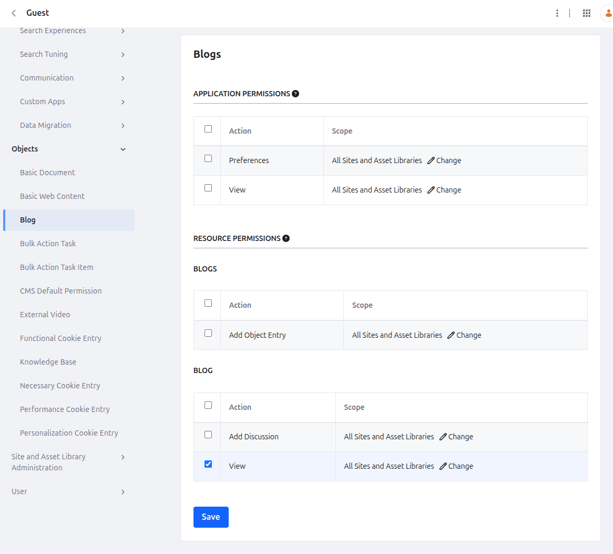

# Liferay Headless Blog - Next.js Sample

This is a [Next.js](https://nextjs.org) made to consume [Liferay](https://www.liferay.com/)'s CMS Blog headless APIs.

## 📋 Prerequisites

Before running this application, ensure you have:

- Node.js 18+ installed
- A running Liferay DXP instance with CMS enabled
- Access to Liferay's Headless CMS APIs

## 🏎️ Getting Started

First, install the dependencies:

```bash
npm install
```

Then run the development server:

```bash
npm run dev
```

Open [http://localhost:3000](http://localhost:3000) with your browser to see the result.

You can start editing the page by modifying `app/page.tsx`. The page auto-updates as you edit the file.

## ⚙️ Configuration

### Liferay

You'll need to add the following rule for the existing `OBJECT_DEFAULT` [Service Access Policy](https://learn.liferay.com/w/dxp/security-and-administration/security/securing-web-services/setting-service-access-policies):

- **Service Class:** `com.liferay.object.rest.internal.resource.v1_0.ObjectEntryResourceImpl`
- **Method Name:** `getScopeScopeKeyPage`

And you'll also need add the permission for the `Guest` user to `VIEW` the `Objects > Blog > Blog` entity.



Read [Defining Role Permissions](https://learn.liferay.com/w/dxp/security-and-administration/users-and-permissions/roles-and-permissions/defining-role-permissions) for more details.

### Application Environment Vars

- `LIFERAY_HOST`: Your Liferay instance URL (usually `http://localhost:8080` for local development).
- `LIFERAY_SPACE_ID`: Your CMS Space ID (aka Group ID, or Scope ID), you can get it in the Space settings.

## 📚 Learn More

To learn more about Liferay's headless APIs, take a look at the following resources:

- [Foundations of Liferay Headless APIs](https://learn.liferay.com/l/29393515)
- [Mastering Consuming Liferay Headless APIs](https://learn.liferay.com/l/29852017)
- [Learn Next.js](https://nextjs.org/learn)
