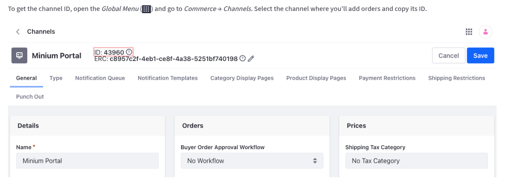

# Liferay Headless Commerce - Next.js Sample

This is a [Next.js](https://nextjs.org) made to consume [Liferay](https://www.liferay.com/)'s Headless Commerce APIs.

## 📋 Prerequisites

Before running this starting, ensure you have installed:

-   Docker
-   Git
-   Node.js 18+

## 🏎️ Getting Started

### 1. Clone the template

To clone the `commerce` template, run:

```bash
wget -q -O- https://raw.githubusercontent.com/liferay/liferay-portal/master/modules/integrations/vercel/templates/clone-template.sh | bash -s -- commerce
```

Or, with `curl`:

```bash
curl -sL https://raw.githubusercontent.com/gabsprates/liferay-portal/LPD-66707_clone/modules/integrations/vercel/templates/clone-template.sh | bash -s -- commerce
```

And then go to your newly created repository:

```bash
cd commerce
```

### 2. Setup your local Liferay instance

For development porpuse, we'll use Docker containers. You can use the following command:

```bash
docker run -it -p 8080:8080 --name liferay-commerce liferay/dxp:latest
```

Once you see the message below, follow the next step:

```
DXP Development license validation passed
License registered for DXP Development
```

Now:

1. Go to your running liferay instance [http://localhost:8080/](http://localhost:8080/);
1. Login with `test@liferay.com` email and `test` password;
    - Once you're in, you'll be asked to change the password other than `test`.

To increase your development experience, we need to create a Commerce site. Follow [this guide](https://learn.liferay.com/w/dxp/commerce/starting-a-store/accelerators), select the `Minium` template and give it a name. Click `Save` and wait until be redirected to the newly created site.

Due to security reasons, Liferay doesn't publically exposes some APIs, and that's why we need to add a [Service Access Policy](https://learn.liferay.com/w/dxp/security-and-administration/security/securing-web-services/setting-service-access-policies). To do that:

1. Go to the [Default Service Access Policies](https://learn.liferay.com/w/dxp/security-and-administration/security/securing-web-services/setting-service-access-policies) page;
1. Open the existing `COMMERCE_DEFAULT` rule;
1. Add a new row and fill it with the following:
    - **Service Class:** `com.liferay.headless.commerce.delivery.catalog.internal.resource.v1_0.ProductResourceImpl`
    - **Method Name:** `getChannelProductByFriendlyUrlPath`

### 3. Run your template

To get your template up and running, first, install the dependencies:

```bash
npm install
```

And before starting it, define your environment variables.

1. Copy the `.env.local.example` file to `.env.local`
1. Define:
    - `LIFERAY_HOST`: Your Liferay instance URL (`http://localhost:8080` for local development).
    - `LIFERAY_CHANNEL_ID`: Your Liferay Commerce Channel ID.
      <br />
    - `NEXT_PUBLIC_SITE_NAME`: Your site name, e.g.: `Minium`.

Once you have your're done, run the development server:

```bash
npm run dev
```

Open [http://localhost:3000](http://localhost:3000) with your browser to see the result.

You can start editing the page by modifying `app/page.tsx`. The page auto-updates as you edit the file.

## 📚 Learn More

-   [Foundations of Liferay Headless APIs](https://learn.liferay.com/l/29393515)
-   [Mastering Consuming Liferay Headless APIs](https://learn.liferay.com/l/29852017)
-   [Liferay Headless Commerce](https://learn.liferay.com/dxp/latest/en/headless-delivery/consuming-apis/headless-commerce.html) - Liferay's headless commerce documentation
-   [Learn Next.js](https://nextjs.org/learn)
