# Liferay Headless Content Page - Next.js Sample

This is a [Next.js](https://nextjs.org) made to consume [Liferay](https://www.liferay.com/)'s CMS Content headless APIs.

## 📋 Prerequisites

Before running this starting, ensure you have installed:

-   Docker
-   Git
-   Node.js 18+

## 🏎️ Getting Started

### 1. Clone the template

To clone the `content-page` template, run:

```bash
wget -q -O- https://raw.githubusercontent.com/liferay/liferay-portal/master/modules/integrations/vercel/templates/clone-template.sh | bash -s -- content-page
```

Or, with `curl`:

```bash
curl -sL https://raw.githubusercontent.com/gabsprates/liferay-portal/LPD-66707_clone/modules/integrations/vercel/templates/clone-template.sh | bash -s -- content-page
```

And then go to your newly created repository:

```bash
cd content-page
```

### 2. Setup your local Liferay instance

For development porpuse, we'll use Docker containers.

Currently, to run a Liferay DXP with the CMS site enabled, we need to enable the following feature flags:

-   Release FF:
    -   LPS-179669
    -   LPD-34594
    -   LPD-21926
-   Development FF:
    -   LPD-11232
    -   LPD-17564

To avoid some manual setup, you can use the following command:

```bash
docker run -it -p 8080:8080 --name liferay-cms \
    -e LIFERAY_FEATURE_PERIOD_FLAG_PERIOD_UI_PERIOD_VISIBLE_OPENBRACKET_DEV_CLOSEBRACKET_=true \
    -e LIFERAY_FEATURE_PERIOD_FLAG_PERIOD__UPPERCASEL__UPPERCASEP__UPPERCASES__MINUS__NUMBER1__NUMBER7__NUMBER9__NUMBER6__NUMBER6__NUMBER9_=true \
    -e LIFERAY_FEATURE_PERIOD_FLAG_PERIOD__UPPERCASEL__UPPERCASEP__UPPERCASED__MINUS__NUMBER3__NUMBER4__NUMBER5__NUMBER9__NUMBER4_=true \
    -e LIFERAY_FEATURE_PERIOD_FLAG_PERIOD__UPPERCASEL__UPPERCASEP__UPPERCASED__MINUS__NUMBER2__NUMBER1__NUMBER9__NUMBER2__NUMBER6_=true \
    -e LIFERAY_FEATURE_PERIOD_FLAG_PERIOD__UPPERCASEL__UPPERCASEP__UPPERCASED__MINUS__NUMBER1__NUMBER1__NUMBER2__NUMBER3__NUMBER2_=true \
    -e LIFERAY_FEATURE_PERIOD_FLAG_PERIOD__UPPERCASEL__UPPERCASEP__UPPERCASED__MINUS__NUMBER1__NUMBER7__NUMBER5__NUMBER6__NUMBER4_=true \
    liferay/dxp:latest
```

Once you see the message below, follow the next step:

```
DXP Development license validation passed
License registered for DXP Development
```

Now:

1. Go to your running liferay instance [http://localhost:8080/](http://localhost:8080/);
1. Login with `test@liferay.com` email and `test` password;
    - Once you're in, you'll be asked to change the password other than `test`.

<!-- <BLOCK: To be removed after 2025.Q4> -->

Currently, we need to create a CMS site. Follow [this guide](https://learn.liferay.com/w/dxp/getting-started/creating-your-first-site) and select the `CMS` template and name it. Click `Save` and wait until see the message `Initialized com.liferay.site.initializer.cms for group XXXXX in XXXX ms` in your terminal. Then, go to [http://localhost:8080/](http://localhost:8080/) again.

<!-- </BLOCK: To be removed after 2025.Q4> -->

Liferay provides a few predefined content structures, but you're free to create your own. Let's create an `Event` structure:

1. Go to the **Structures** page and create add a new `Content` structure;
   <br />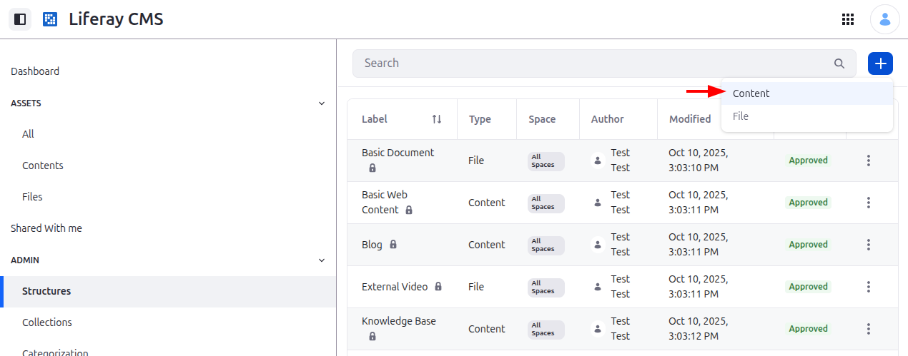
1. Edit the structure name and make it available for all spaces:
   <br />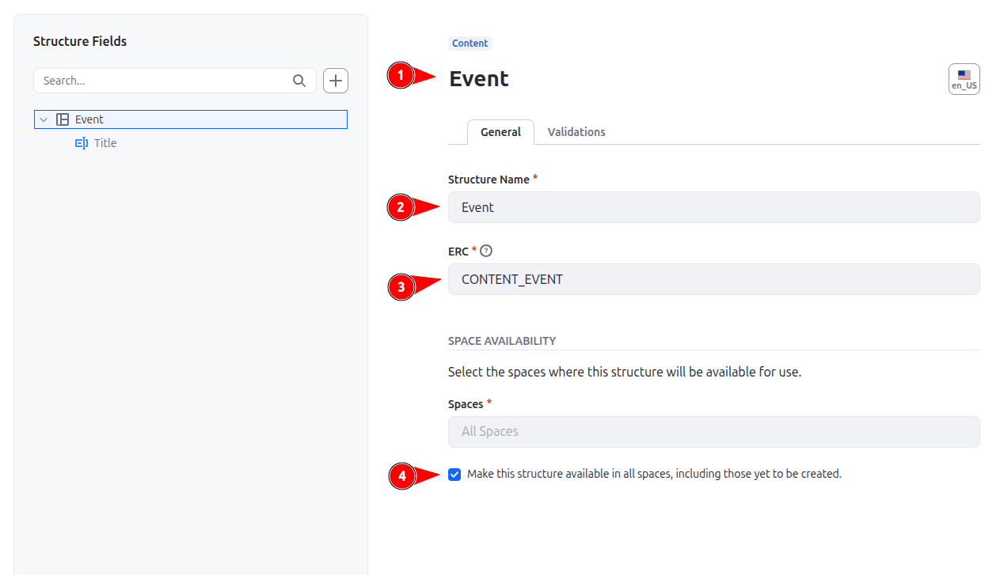
1. Edit the `Title` field:
   <br />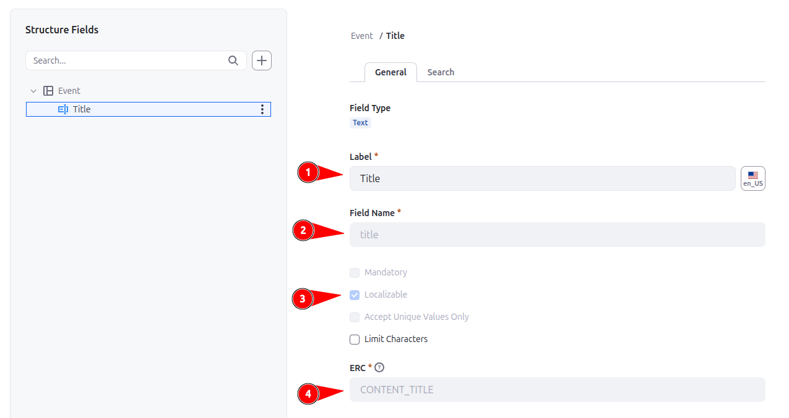
1. Edit the `Content` field:
   <br />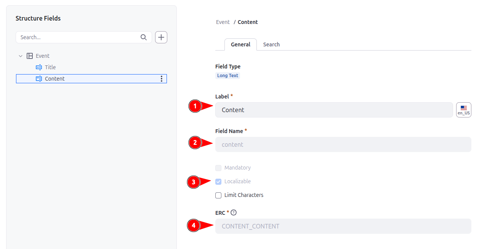
1. Edit the `Summary` field:
   <br />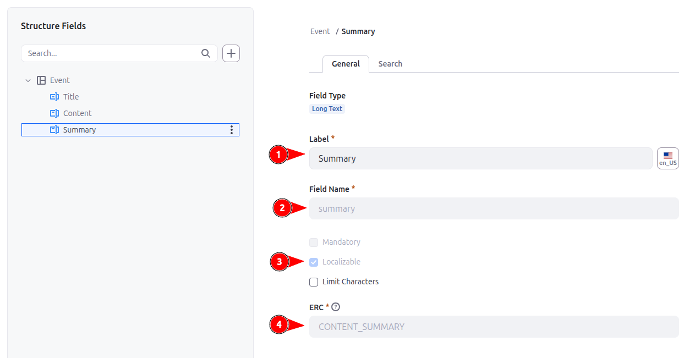
1. Edit the `Image` field:
   <br />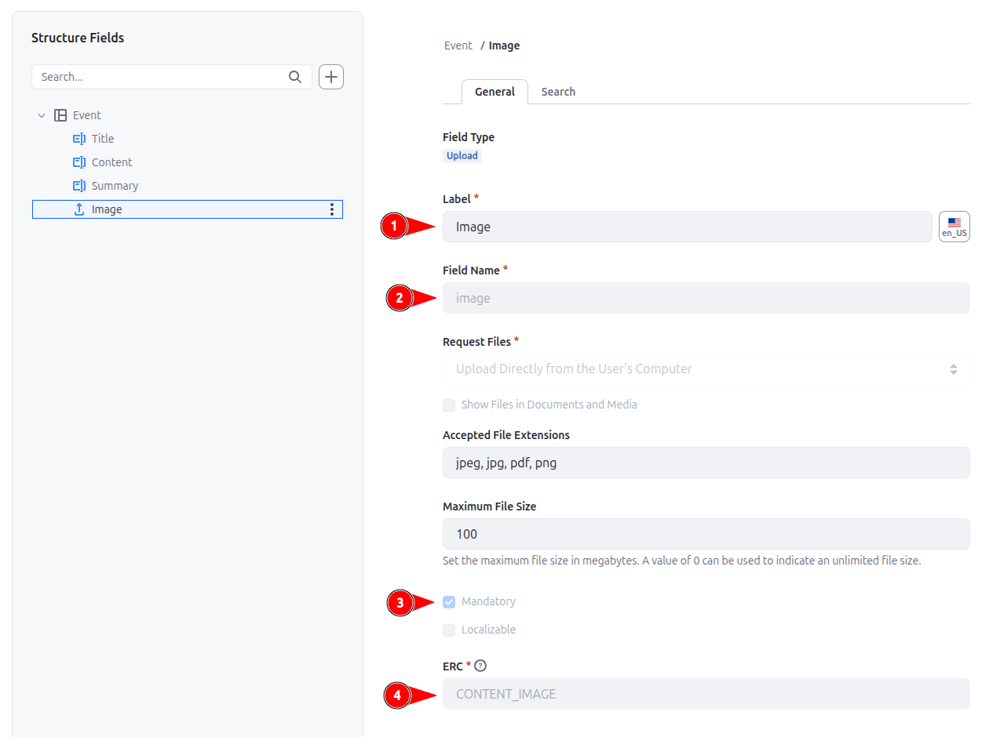
1. Edit the `Location Map Url` field:
   <br />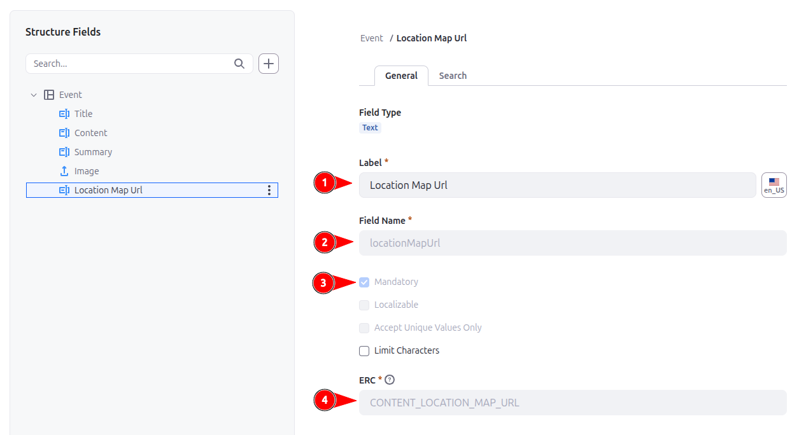
1. Edit the `Location Name` field:
   <br />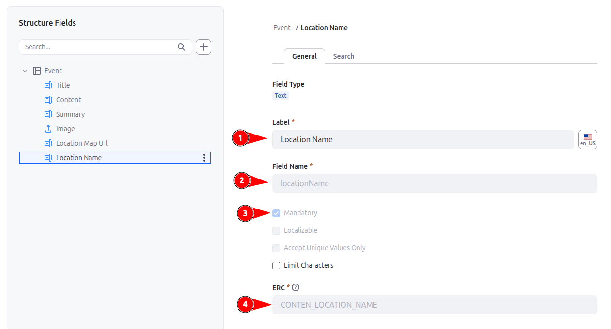
1. Edit the `Registration Link` field:
   <br />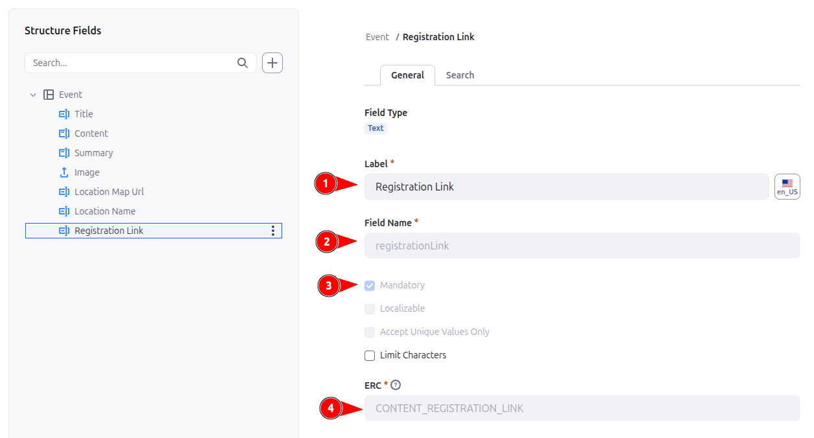
1. Publish it.

Now you're able to create new `Event`s:

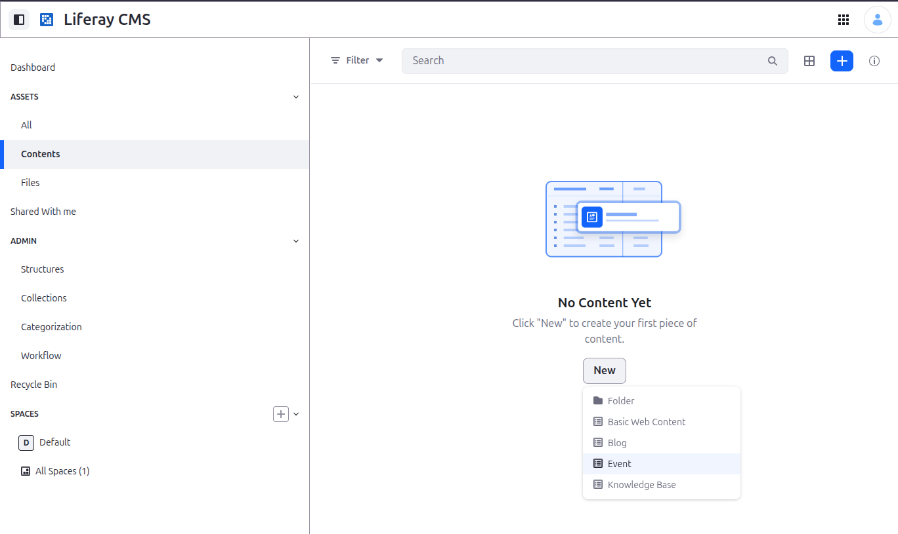

Save the ID present in the URL and Global Menu:

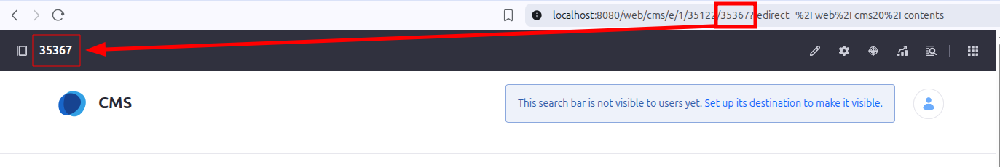

Fill the form and save your content.

Due to security reasons, Liferay doesn't publically exposes some APIs, and that's why we need to add a [Service Access Policy](https://learn.liferay.com/w/dxp/security-and-administration/security/securing-web-services/setting-service-access-policies). To do that:

1. Go to the [Default Service Access Policies](https://learn.liferay.com/w/dxp/security-and-administration/security/securing-web-services/setting-service-access-policies) page;
1. Open the existing `OBJECT_DEFAULT` rule;
1. Add a new row and fill it with the following:
    - **Service Class:** `com.liferay.object.rest.internal.resource.v1_0.ObjectEntryRelatedObjectsResourceImpl`
    - **Method Name:** `getCurrentObjectEntriesObjectRelationshipNamePage`

Once that API is now public, we need to make a Guest user (an unauthenticated one) able to see the content provided by it. To do that, follow the steps in [Defining Role Permissions](https://learn.liferay.com/w/dxp/security-and-administration/users-and-permissions/roles-and-permissions/defining-role-permissions) and add the following permissions for the `Guest` role:

-   Under `Objects > [ YOUR CUSTOM CONTENT ENTITY ] > [ YOUR CUSTOM CONTENT ENTITY ]`, add `VIEW` permission.
    <br />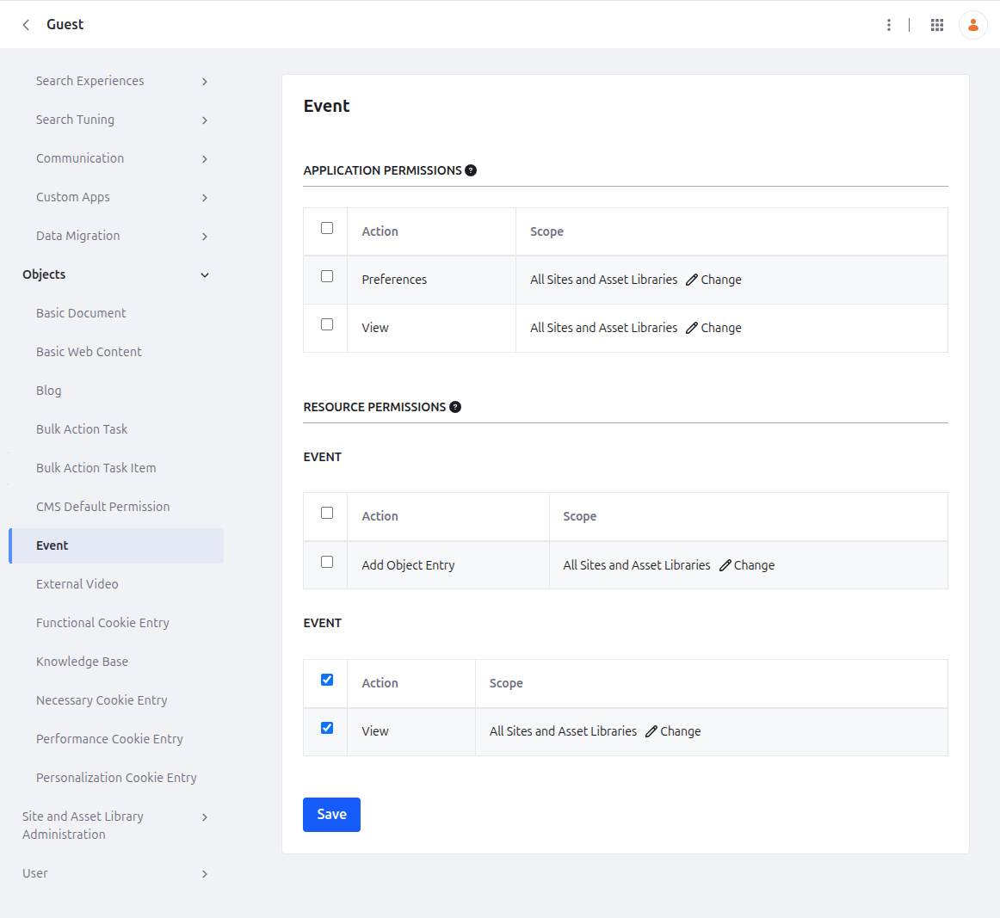

### 3. Run your template

To get your template up and running, first, install the dependencies:

```bash
npm install
```

And before starting it, define your environment variables.

1. Copy the `.env.local.example` file to `.env.local`
1. Define:
    - `LIFERAY_LANGUAGES`: The available languages that you can consume to extract data to display (e.g.: `en_US,es_ES,pt_BR`).
    - `LIFERAY_CONTENT_PATH`: Your content path, including ID
        - If you're using a custom structure, it will be like `/o/c/[ structure_name ]/[ content_ID ]`;
            - In our example, that would be: `/o/c/events/35367`
        - If you're using the existing Basic Web Content, it will be like `/o/cms/basic-documents/[ content_ID ]`.
        - You can find the `content_ID` in the content details page.

Once you have your're done, run the development server:

```bash
npm run dev
```

Open [http://localhost:3000](http://localhost:3000) with your browser to see the result.

You can start editing the page by modifying `app/page.tsx`. The page auto-updates as you edit the file.

## 📚 Learn More

To learn more about Liferay's headless APIs, take a look at the following resources:

-   [Foundations of Liferay Headless APIs](https://learn.liferay.com/l/29393515)
-   [Mastering Consuming Liferay Headless APIs](https://learn.liferay.com/l/29852017)
-   [Learn Next.js](https://nextjs.org/learn)
