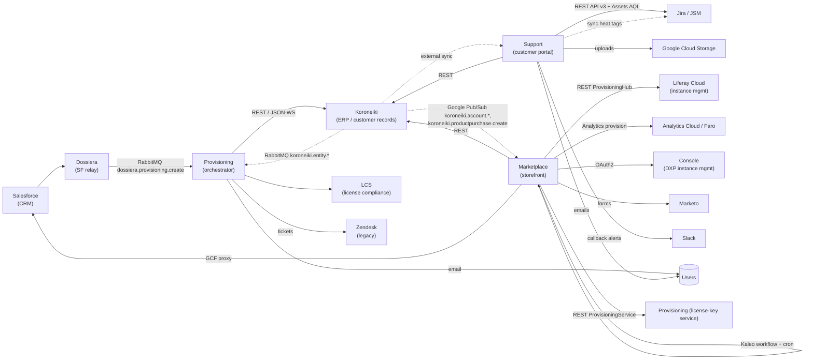

# Cross-System Integrations

This document stitches the four systems — Koroneiki, Provisioning, Marketplace, Support — together, plus the external services they all depend on. Read this after the four per-system audits to understand the seams that the consolidation will either erase (where two systems talk to each other) or preserve (where one system talks to the outside world).

---

## 1. One-Line Summary

**Koroneiki is the center.** It owns customer Accounts, Contacts, Teams, Products, Purchases, and Entitlements. The other three orbit it:

- **Provisioning** is an event-driven orchestrator that turns Salesforce opportunities (via Dossiera) into Koroneiki records.
- **Marketplace** is a publisher/commerce storefront that reads Koroneiki and writes orders + license keys via a separate provisioning path.
- **Support** is a customer portal that reads Koroneiki (as a side-car mirror) and fronts Jira ticketing.

When consolidated, Koroneiki's entities become the spine of the new workspace; Provisioning dissolves into Object Actions + scheduled tasks; Marketplace and Support port forward as specialized Object subsets and UIs.

---

## 2. System-to-System Dependency Map

Solid arrows are synchronous requests. Dashed arrows are async message delivery.

---

## 3. Shared Data & Concepts

Several concepts appear under different names across the systems. When consolidating to a single set of Liferay Objects, these must be unified:

| Concept | Koroneiki | Provisioning | Marketplace | Support |
|---|---|---|---|---|
| **Customer organization** | `Account` | (proxies Koroneiki Account) | `AccountEntry` (Liferay core) + Salesforce opportunity data | `KoroneikiAccount` (side-car mirror of Koroneiki Account) |
| **Person** | `Contact` (lazy-mirrors osb-entity-web user uuid) | (proxies Koroneiki Contact) | `AccountEntry` member + Marketo form submissions | Liferay User + `TeamMembersInvitation` |
| **Team** | `Team` + system-maintained default team per account | (proxies Koroneiki Team) | — | — |
| **Product catalog** | `ProductEntry` (master) | (proxies Koroneiki ProductEntry) | `CPDefinition` (Commerce) | `AccountSubscription.productKey` (text ref) |
| **Subscription / purchase** | `ProductPurchase` + `ProductConsumption` | — (owns only `ProductBundle` bundles) | `CommerceOrder` + custom fields | `AccountSubscription` + `AccountSubscriptionGroup` + `AccountSubscriptionTerm` |
| **License key** | — | `Provisioning_LicenseKey` (230K rows) | (consumes via REST) | `ReplacementActivationKeyRequest` (form) |
| **Entitlement** | `Entitlement` + `EntitlementDefinition` (SQL-driven) | — | (queried via Koroneiki REST) | `AccountFlag` (boolean flags) |
| **External-system reference** | `ExternalLink (domain, entityName, entityId)` | — | `CommerceOrder.customFields` JSON | Hard-coded fields (e.g., `jiraIssueKey`, `zendeskTicketId`) |
| **Ticket / support contact** | — | creates Zendesk ticket | — | references Jira issue via `TicketAttachment.jiraIssueKey` (+ legacy `zendeskTicketId`) |

**Consolidation implications:**

- **Customer org:** One Liferay Object. The AccountEntry in Liferay core already plays this role in the newer workspaces; Koroneiki's Account data is overlay. Decide whether to use Liferay AccountEntry directly and add custom fields for tier/region/code, or introduce a Koroneiki Account Object that relates to AccountEntry.
- **Person:** Prefer Liferay User (+ account membership) over a separate Contact Object. The Koroneiki uuid-matching trick with osb-entity-web dissolves if you use Liferay Users directly.
- **Product catalog:** Two catalogs exist today — Koroneiki `ProductEntry` (SKU-like) and Commerce `CPDefinition` (priced storefront items). Decide which is canonical; they currently are loosely cross-referenced via name strings.
- **Subscription:** Three separate models today (`ProductPurchase` in Koroneiki, `AccountSubscription` in Support, `CommerceOrder` in Marketplace). They probably need **one** Object with lifecycle states for Trial / Active / Expired / Cancelled, plus a relationship to licenses.
- **License key:** Should become an Object with generation logic as Object Action. The 230K rows in `prov` are the migration target.
- **Entitlement:** The SQL-driven `EntitlementDefinition` is the biggest logic-rewrite target in the consolidation. Review each of the 62 live definitions and decide whether they collapse into Object filter criteria, Object Actions, or a scheduled sync task.

---

## 4. Integration Boundaries (What Talks to What)

### Koroneiki ↔ Provisioning (tightest coupling)

- **Provisioning reads and writes Koroneiki via REST** (`osb-provisioning-koroneiki` client → Phloem `/o/koroneiki-rest/v1.0/`). Primary flows: create account on Salesforce win, assign contacts, add product purchases.
- **Koroneiki pushes events to Provisioning via RabbitMQ** (`koroneiki.productpurchase.{create,update,delete}`, `koroneiki.product.delete`). Provisioning syncs these to LCS.
- **Consolidation:** merges into Object Actions on a single Account/ProductPurchase Object. Messaging layer disappears within the workspace; remains only for downstream consumers outside the workspace (LCS?).

### Koroneiki ↔ Marketplace

- **Marketplace reads Koroneiki via REST** (`KoroneikiService` with API-key auth). Flows: resolve user email → contact → teams; fetch entitlements on trial provisioning; register product purchase with entitlement system.
- **Koroneiki pushes events to Marketplace via Google Pub/Sub** (`koroneiki.account.create`, `.update`, `.productpurchase.create`). **Note:** Marketplace runs on Pub/Sub while Provisioning runs on RabbitMQ — likely a bridged pipeline somewhere (confirm with infra team).
- **Consolidation:** Marketplace Objects reference the unified Account Object directly. Pub/Sub topic listeners become Object Actions.

### Koroneiki ↔ Support

- **Support holds a `KoroneikiAccount` side-car mirror (2,313 rows) of Koroneiki Account data.** The sync mechanism is not visible in the Support codebase — likely a scheduled ETL or batched REST sync run externally.
- **Support writes back into Jira Assets** (`api.atlassian.com/jsm/assets/workspace/{id}`) with `objectSchema=Koroneiki, objectType=Account` so agents in Jira can see the account alongside the ticket.
- **Consolidation:** `KoroneikiAccount` side-car disappears when the workspace owns the real Account Object. Jira Assets sync remains as an outbound integration.

### Marketplace → Provisioning (license keys)

- **Marketplace calls a `ProvisioningService` via OAuth2 (`external-provisioning` scope) for license key generation.** `POST /app-license-keys`, `GET /license-keys`. Triggered on paid order completion.
- **Important ambiguity:** the Marketplace audit calls this "Provisioning." The 230K `Provisioning_LicenseKey` rows in `prov` DB suggest this is the **same system** as osb-provisioning, but the osb-provisioning audit found **no REST API** in its codebase. Either (a) there's an older sibling module (`osb-provisioning-license*`) that exposes a REST license-key API and was missed in the osb-provisioning audit, or (b) "Provisioning" in the Marketplace context is a different service. **Confirm before planning.**
- **Consolidation:** license key generation becomes an Object Action on a LicenseKey Object.

### Marketplace → Provisioning Hub (cloud instances)

- Separate from license keys. `ProvisioningHubService` client, `POST /instances`. Used to create trial portal instances in Liferay Cloud. Managed by the `_processInProgressTrials`, `_processOnHoldTrials` cron jobs.
- **Consolidation:** remains an outbound integration to Liferay Cloud.

### Support → Provisioning (thin)

- Support has a `Provisioning Member` role, `provisioning-server-api` property, and raysource services referencing provisioning. The integration is not data-heavy; it surfaces provisioning status in the UI.
- **Consolidation:** collapses when Support and Provisioning logic share the workspace.

### Support ↔ Jira (primary)

- **Jira is Support's ticket system of record.** Projects: `LRHC` (Help Center), `LRFLS` (First Line Support), `LSV` (Security Vulnerabilities).
- **Attachments flow:** Customer uploads to GCS → Liferay stores metadata in `TicketAttachment` → Spring Boot posts Jira comment (Atlassian Document Format) linking the download.
- **Heat tags:** Daily `scheduledHeatTagUpdate` sets `impacting_business_event`, `<heat>_be` labels on Jira tickets per account.
- **Security vulnerabilities:** `/security-vulnerabilities` page reads Jira `LSV` project issues live.
- **Consolidation:** Jira remains outbound. All integration code ports forward unchanged.

### Legacy Zendesk

- **Provisioning actively creates Zendesk tickets** (on new subscriptions with product family ≠ "P", and for any message-processing error).
- **Support has vestigial Zendesk references only** — `zendeskTicketId` field on `TicketAttachment`, no live code paths.
- **Consolidation:** likely retire Zendesk. Confirm Provisioning's tickets can move to Jira. Keep `zendeskTicketId` historical field for old TicketAttachment rows or drop after archival.

---

## 5. External Systems (Outside the Four)

All four systems share exposure to a common set of external services. Consolidation preserves these boundaries:

| External system | Used by | Purpose |
|---|---|---|
| **Salesforce** | Provisioning (inbound via Dossiera), Marketplace (outbound via GCF) | Opportunity-to-account conversion; order-to-opportunity backwrite |
| **Dossiera** | Provisioning (inbound) | Salesforce relay + product/account ExternalLinks |
| **LCS** | Provisioning (outbound) | License subscription compliance sync |
| **Jira / JSM** | Support (primary) | Ticketing, Assets, security vulnerabilities |
| **Zendesk** | Provisioning (active), Support (legacy refs) | Legacy ticketing |
| **Google Cloud Storage** | Support | Large file attachments |
| **Google Cloud Functions** | Marketplace | Salesforce proxy |
| **Google Pub/Sub** | Marketplace (inbound from Koroneiki) | Event bus |
| **RabbitMQ** | Koroneiki (out), Provisioning (in) | Event bus |
| **Liferay Cloud** | Marketplace (trial instances) | Portal instance lifecycle |
| **Console (DXP instance mgmt)** | Marketplace | DXP deployment orchestration |
| **Analytics Cloud / Faro** | Marketplace, Support | Workspace provisioning + usage reporting |
| **Marketo** | Marketplace | Marketing forms |
| **osb-entity-web** | Koroneiki (inbound identity) | User master; Contact.uuid ≡ User.uuid |
| **Slack** | Support | Callback alerts via email bridge |
| **Email / SMTP** | All four | User notifications |

---

## 6. Event & Message Topology

Three messaging layers exist today:

**RabbitMQ (on-prem legacy)**
- Koroneiki broadcasts `koroneiki.<entity>.<create|update|delete>` to *both* LegacyMessageBroker and XylemMessageBroker (double-publish).
- Provisioning consumes `dossiera.provisioning.create` (Dossiera → Provisioning, queue `is_osb_provisioning_queue`) and `koroneiki.productpurchase.*` + `koroneiki.product.delete` (Koroneiki → Provisioning).
- Koroneiki consumes `entity.user.update` (osb-entity-web → Koroneiki, queue `is_osb_koroneiki_queue`).

**Google Pub/Sub (cloud)**
- Marketplace consumes `koroneiki.account.create`, `koroneiki.account.update`, `koroneiki.productpurchase.create`. These match Koroneiki's RabbitMQ topic names exactly — a bridge is probably running somewhere (confirm).

**Jira webhooks (implicit)**
- Support's attachment cleanup timing implies Jira webhook-driven status checks. No explicit handler in code.

**Consolidation opportunity:** if the new workspace owns Account + ProductPurchase directly, most RabbitMQ topics terminate inside the workspace. Outbound messaging remains for external consumers (LCS, Marketplace-on-Pub-Sub if Marketplace stays separate in early phases).

---

## 7. Authentication Patterns

A mix of patterns — worth standardizing in the new workspace:

| System | How it authenticates callers |
|---|---|
| Koroneiki | Bearer token → SHA-256 digest match → impersonates a ServiceProducer's authorization user |
| Provisioning | API token header on Koroneiki client; no inbound REST |
| Marketplace | OAuth2 Headless Server (`-oahs`) and User Agent (`-oaua`) client extensions for its Spring Boot endpoints; OAuth2 + OIDC for Salesforce GCF |
| Support | OAuth2 via `-oahs`/`-oaua` CE's; Jira API token; GCS service account; `api.token` for Koroneiki |

**Consolidation:** standardize on Liferay's OAuth2 client credentials for all service-to-service calls. The Koroneiki "impersonation" pattern is unusual — decide whether to reproduce it with explicit actor modeling or discard.

---

## 8. What Consolidation Specifically Collapses

When all four systems live in one workspace on top of unified Liferay Objects:

| Today | In the new workspace |
|---|---|
| Koroneiki Account + Support KoroneikiAccount side-car | One Account Object (probably AccountEntry + custom fields) |
| Koroneiki Contact + osb-entity-web User | One Liferay User + account-membership relationship |
| Koroneiki ProductPurchase + Support AccountSubscription + Marketplace CommerceOrder fields | One Subscription Object with lifecycle states |
| Provisioning DossieraCreateMessageSubscriber (500+ LOC orchestrator) | Object Actions on Account create + Object validations |
| Koroneiki EntitlementDefinition raw-SQL scheduler | Scheduled task running Object filter criteria (or scripted action) |
| Koroneiki → Provisioning RabbitMQ fan-out | Object Actions fire synchronously; outbound webhook only if external systems still listen |
| Provisioning → Koroneiki REST layer | Direct Object Service Layer calls |
| Support KoroneikiAccount sync mechanism (external) | Dissolves — Support and Koroneiki share the Object |
| Marketplace Koroneiki REST client | Direct Object lookups or headless calls within the same workspace |

### What stays external

- Salesforce ↔ new workspace (however Dossiera is replaced)
- Jira / JSM
- Google Cloud Storage for attachments
- Liferay Cloud (portal instance provisioning)
- Analytics Cloud / Faro
- Marketo
- LCS (if LCS is being retired during consolidation, this too collapses)
- Email / Slack

---

## 9. Open Integration Questions for the Planning Phase

_Status: see `../plan/system-spec.md` for resolutions. Questions that remain open are marked below._

1. **Still open.** Who is "Provisioning" in the Marketplace's `ProvisioningService` call? Is it osb-provisioning (which has no REST API in the audited source) or a sibling license-key service (`Provisioning_LicenseKey`'s 230K rows suggest there's real code somewhere)? _Phase-3 blocker per plan §10 Risk #2._

1. **Still open.** Who bridges RabbitMQ (`koroneiki.*`) to Google Pub/Sub (`koroneiki.*`)? The topic names match — is there a replicator service, or does Koroneiki publish to both buses directly? _Becomes moot per D11 (bus retired); verify no external consumer before phase 6 cutover._

1. **Still open.** How does Support's `KoroneikiAccount` sync run? The Support codebase has no scheduler or subscriber for this — must be external. _Phase-5 blocker per plan §10 Risk #6._

1. ~~**Is Dossiera being retired?**~~ _Resolved per D12: yes. SF Pub/Sub topic stays; subscriber moves in-workspace; Dossiera relay drops in phase 3._

1. ~~**Is LCS being retired?**~~ _Resolved: LCS is already retired at the business layer. Vestigial code drops without replacement._

1. **Still open.** What's the fate of the legacy `OSB_*` and `Marketplace_App/Module` tables in `prov`? _Deferred to phase 6 retention decision per plan §10 Risk #10._

1. ~~**Which of Koroneiki's 62 `EntitlementDefinition.definition` rules are still active?**~~ _Resolved: all 62 reviewed — see `../plan/entitlement-rules-review.md`. 59 Object filters + 3 scripted actions + 0 retirements._

1. ~~**Does the 17M-row `Koroneiki_AuditEntry` need to port forward?**~~ _Resolved per D14: archive to flat file (JSON lines on GCS). Liferay Object built-in versioning takes over going forward._