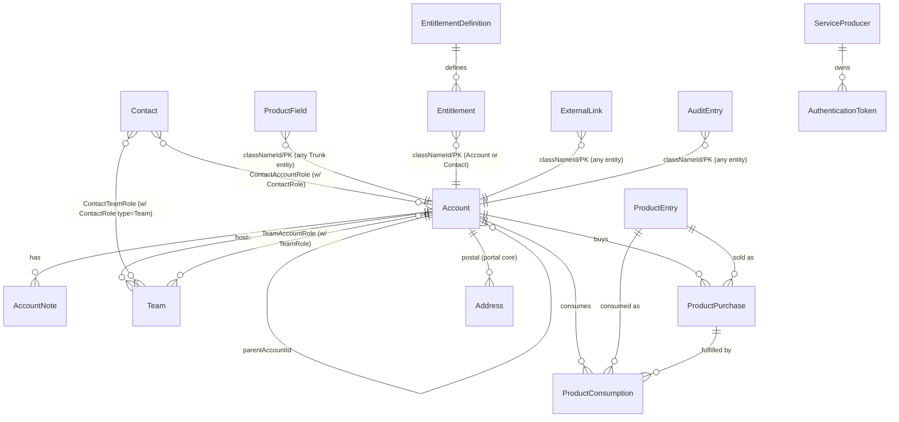

# Koroneiki System Audit

## 1. Purpose & Scope

Koroneiki ("Kor", formerly "corp") is Liferay's internal **ERP / entitlement management system**. It is the authoritative source of record for customer **Accounts**, their **Contacts** (people), the **Teams** that group contacts on accounts, the **Products** those accounts have **Purchased**, the **Consumption** of those purchases, and **Entitlements** granting features to accounts or contacts.

It is designed as a "rootstock" for other Liferay business systems (Provisioning, Marketplace, Support, customer portal, LCS, Dossiera, Salesforce) to graft onto via REST and RabbitMQ events. It does **not** own orders, billing, or tickets — those live in the grafted systems, which reference Koroneiki via `ExternalLink` records.

Codebase: `<liferay-portal-ee>/modules/dxp/apps/osb/osb-koroneiki/`
Database: `kor`

### Module layout (tree-themed)

| Submodule | Role |
|---|---|
| `osb-koroneiki-root` | Cross-cutting plumbing: `AuditEntry`, `ExternalLink`, audit `ModelListener`s, shared utilities, `ContactIdentityProvider` SPI that imports contacts from osb-entity-web |
| `osb-koroneiki-taproot` | Core "nouns": Account, Contact, Team, ContactRole, TeamRole, AccountNote + junction tables. Admin UIs |
| `osb-koroneiki-trunk` | Product model: ProductEntry, ProductPurchase, ProductConsumption, ProductField (dynamic key/value). Admin UI |
| `osb-koroneiki-phytohormone` | Entitlements: Entitlement, EntitlementDefinition (SQL-defined, periodically synced). Entitlement sync scheduler |
| `osb-koroneiki-scion` | Service-to-service auth: ServiceProducer + AuthenticationToken (SHA-256 hashed tokens) |
| `osb-koroneiki-phloem` | Outward-facing REST + GraphQL (`/o/koroneiki-rest`). ServiceProducerAuthVerifier |
| `osb-koroneiki-xylem` | Outbound RabbitMQ fan-out (model listeners → legacy + xylem brokers). Inbound `entity.user.update` subscriber |
| `osb-koroneiki-application-list` | Declares "Koroneiki" panel category |
| `osb-koroneiki-data-migration` | One-shot migration from legacy `OSB_*` tables to Koroneiki entities |

Phloem is the seam other systems touch. Taproot/Trunk/Phytohormone/Root/Scion are the data model. Xylem is how other systems hear about changes.

---

## 2. Data Model

All tables are Service Builder with `Koroneiki_` prefix and MVCC. Public identifiers use opaque "keys" (`ModelKeyGenerator`) so numeric PKs never leak through the API.

### Customer / Organization (Taproot — future Objects)

**Account** (`Koroneiki_Account`) — Customer org. Self-referential tree via `parentAccountId`. Columns: `name`, `code` (unique, uppercased), `description`, `contactEmailAddress`, `profileEmailAddress`, `phoneNumber`, `faxNumber`, `website`, `tier` (OEM / Premier / Regular / Strategic), `region` (Australia / Brazil / China / Global / Hungary / India / Japan / Spain / United States), `internal` (test-account flag), `status` (Approved / Closed / Expired / Inactive), `logoId` (**deprecated**). Postal addresses use core `Address` (not a Koroneiki table).

**Contact** (`Koroneiki_Contact`) — Person. `uuid` matches the external osb-entity-web `User.uuid`. Columns: `firstName`, `middleName`, `lastName`, `emailAddress`, `languageId`, `emailAddressVerified`.

**Team** (`Koroneiki_Team`) — Group of contacts on exactly one account. `system=true` marks the auto-managed default team that mirrors the Account's customer contacts.

**AccountNote** (`Koroneiki_AccountNote`) — Free-text notes. Columns: `type` (General / Sales), `priority` (int, lower = more important), `content`, `format`, `status` (Approved / Archived), plus **frozen** `creatorName`/`creatorUID`/`modifierName`/`modifierUID` (survives user deletion).

**ContactRole** (`Koroneiki_ContactRole`) — Named role with `type`: `Account Customer`, `Account Worker`, or `Team`. `system=true` protects built-ins.

**TeamRole** (`Koroneiki_TeamRole`) — Same pattern for team-level roles.

### Product (Trunk — future Objects)

**ProductEntry** (`Koroneiki_ProductEntry`) — Catalog item by `name`.

**ProductPurchase** (`Koroneiki_ProductPurchase`) — What an Account bought. `startDate`, `endDate`, `originalEndDate` (sales-original before extensions/grace), `quantity`, `status` (Approved / Cancelled). Null start/end = "perpetual".

**ProductConsumption** (`Koroneiki_ProductConsumption`) — Specific use of a purchase (one LCS env, one license-key activation). References `ProductPurchase` + `Account`. Own `startDate`/`endDate`.

**ProductField** (`Koroneiki_ProductField`) — Generic `(classNameId, classPK, name, value)` side-table that attaches arbitrary string properties to any Trunk entity. Surfaces as the `properties` map on Product/ProductPurchase/ProductConsumption. Equivalent to Object custom fields.

### Entitlement (Phytohormone — future Object)

**EntitlementDefinition** (`Koroneiki_EntitlementDefinition`) — Names an entitlement, binds it to a target `classNameId` (Account or Contact), and has a `definition` column that is a **raw SQL WHERE clause / SELECT** the scheduler runs. `status` is Approved/Inactive. `[$NOW$]` in the SQL is token-replaced with the current timestamp.

**Entitlement** (`Koroneiki_Entitlement`) — Materialized row, one per (definition, target). Junction between an EntitlementDefinition and an Account or Contact.

### Auth (Scion — plumbing)

**ServiceProducer** (`Koroneiki_ServiceProducer`) — Named external system (e.g., "Provisioning") authorized to call the API. `authorizationUserId` is the portal user the token impersonates.

**AuthenticationToken** (`Koroneiki_AuthenticationToken`) — Issued token. Stores only SHA-256 `digest` + 6-char `prefix`; plaintext shown once at creation.

### Plumbing (don't recreate as Objects)

**AuditEntry** (`Koroneiki_AuditEntry`) — Generic audit log rooted at `(classNameId, classPK)`, optional nested `(fieldClassNameId, fieldClassPK)`, `action` (Add / Assign / Delete / Renew / Unassign / Update), `oldValue`/`newValue`/`oldLabel`/`newLabel`, `auditSetId` grouping. Populated by model listeners in `osb-koroneiki-root-audit`. Maps to built-in Object audit.

**ExternalLink** (`Koroneiki_ExternalLink`) — `(domain, entityName, entityId)` pointers from any Koroneiki entity to a record in another system. Domains: `customer`, `dossiera`, `lcs`, `salesforce`, `web`. Entity names: `license-key`, `account`, `opportunity`, `project`, `corp-project`, `organization`.

**Junction tables**: `Koroneiki_ContactAccountRole`, `Koroneiki_ContactTeamRole`, `Koroneiki_TeamAccountRole` assign a role on a specific pairing. Composite PKs, no audit columns.

### Diagram

### Identity Bridges

- Taproot entities carry Liferay `uuid`.
- Every non-junction entity also has `xxxKey` — the public stable id used in REST URLs (generated via `ModelKeyGenerator.generate(id)`).
- **`Contact.uuid` equals the external osb-entity-web user UUID.** When a caller references a Contact not yet in Koroneiki, `WebContactIdentityProvider` imports from `/osb-entity-web/users/{uuid}` or `/osb-entity-web/users/email_address?emailAddress=...` and creates the row lazily.

---

## 3. Business Logic

### Validation

- **Account**: `name` required; `code` unique (case-insensitive, uppercased); `parentAccountId` cannot equal self or create a cycle. Delete with children throws `RequiredAccountException`.
- **Account delete cascade**: cascades AccountNote, ContactAccountRole, Entitlement (by classNameId/classPK), ExternalLink, Team (each deleted individually), TeamAccountRole, Liferay `Resource` (permissions). **Does NOT cascade Address, ProductPurchase, ProductConsumption** — silent orphan risk (§7 gotcha).
- **ProductPurchase**: account + product required, quantity > 0, `endDate >= startDate`, `originalEndDate` defaults to `endDate`.
- **ContactRole / TeamRole**: `name` required, `type` in enum, `(name, type)` unique.
- **ExternalLink**: `domain`, `entityName`, `entityId` all required.
- **EntitlementDefinition**: `name` and `definition` required; SQL is executed directly — trusted admin input.

### Lifecycle / Side Effects

- **Account create or update** triggers `TeamLocalService.syncDefaultTeam(accountId)`: Koroneiki auto-maintains one "system" Team per account whose name mirrors the account. Reconciles team members with all contacts holding the `Account Customer` ContactRole. Missing contacts added with `Member` TeamRole; removed contacts dropped. In Objects: server-side Action on Account save, or an Object scheduled task.
- **AuthenticationToken create**: caller passes plaintext; service stores SHA-256 Base64 digest + first 6 chars as `prefix`. `ServiceProducerAuthVerifier` (`/o/koroneiki-rest/*`) re-digests incoming Bearer tokens and looks up by `(digest, status=Approved)`.
- **Contact import on demand**: any REST endpoint that accepts an email or contact UUID not yet known triggers `WebContactIdentityProvider` to fetch from osb-entity-web and create the Contact. Failures trigger an HTML error email to a configured admin mailbox.

### Scheduled Jobs

**SynchronizeEntitlementsMessageListener** (`osb-koroneiki-phytohormone-service`) — every 15 min by default (`check.interval`, OSGi-configurable).

For each Approved `EntitlementDefinition` (separately for Account-targeted and Contact-targeted):

1. Runs the definition SQL with appended `classPK NOT IN (SELECT classPK FROM Koroneiki_Entitlement WHERE entitlementDefinitionId = ?)` — **grants** for newly-matching rows.

1. Runs the complement — **revokes** entitlements whose `classPK` no longer matches.

`[$NOW$]` is replaced with current timestamp each run. Set-based, eventually-consistent grant/revoke loop driven by SQL.

In Objects: scheduled task + Object relationship; direct SQL becomes criteria-based Object filter or scripted action.

**No other `SchedulerEntry`/`BaseMessageListener` instances exist.**

### Audit Trail

Every major entity has a `ModelListener` in `osb-koroneiki-root-audit` writing to `Koroneiki_AuditEntry`. Listeners for: Account, AccountNote, Address, AuthenticationToken, Contact, ContactAccountRole, ContactRole, ContactTeamRole, Entitlement, EntitlementDefinition, ExternalLink, ProductConsumption, ProductEntry, ProductField, ProductPurchase, ServiceProducer, Team, TeamAccountRole, TeamRole.

Actions: Add, Update, Delete, Assign, Unassign, Renew. Field-level diffs stored with old/new label + value, grouped by `auditSetId`.

### Permissions

Liferay resource-action permissions, not a custom state machine. Action keys from `resource-actions/default.xml`:

- Container-level: `ADD_ACCOUNT`, `ADD_CONTACT`, `ADD_CONTACT_ROLE`, `ADD_TEAM`, `ADD_TEAM_ROLE` (+ Phytohormone / Trunk / Scion equivalents).
- Instance-level: `VIEW`, `UPDATE`, `DELETE`, `ASSIGN_CONTACT`, `ASSIGN_TEAM`. Returned as `*Permission` DTOs.

---

## 4. APIs / External Surface

### Phloem REST — `/o/koroneiki-rest/v1.0/`

Application: `KoroneikiRESTApplication`, name `Liferay.Koroneiki.REST`.

**Accounts**: `/accounts`, `/accounts/{accountKey}`, `/accounts/by-external-link/{domain}/{entityName}/{entityId}`, `/accounts/entitlement-definitions`, `/accounts/{accountKey}/account-permissions`, `/accounts/{accountKey}/child-accounts`, `/accounts/{accountKey}/audit-entries`, `/accounts/{accountKey}/notes`, `/accounts/{accountKey}/postal-addresses`, `/accounts/{accountKey}/external-links`, `/accounts/{accountKey}/product-purchases`, `/accounts/{accountKey}/product-consumptions`, `/accounts/{accountKey}/product/{productKey}/product-purchase-view`.

**Account membership**: `/accounts/{accountKey}/contacts`, `/accounts/{accountKey}/customer-contacts` (+ by-email-address / by-uuid + `/roles`), `/accounts/{accountKey}/worker-contacts` (ditto), `/accounts/{accountKey}/teams`, `/accounts/{accountKey}/assigned-teams` (and `.../{teamKey}/roles`).

**Contacts**: `/contacts`, `/contacts/by-email-address/{emailAddress}`, `/contacts/by-uuid/{contactUuid}` + `/accounts`, `/audit-entries`, `/contact-account-views`, `/contact-permissions`, `/external-links`, `/product-consumptions`, `/product-purchases`. Plus `/contacts/entitlement-definitions`.

**Contact Roles**: `/contact-roles`, `/contact-roles/{contactRoleKey}` (+ `/audit-entries`, `/contact-role-permissions`), `/contact-roles/{contactRoleType}/{contactRoleName}`.

**Teams**: `/teams`, `/teams/{teamKey}` (+ `/assigned-accounts`, `/audit-entries`, `/contacts`, `/contacts/by-email-address`, `/contacts/by-uuid`, `/external-links`, `/team-permissions`), `/teams/by-external-link/{domain}/{entityName}/{entityId}`.

**Team Roles**: `/team-roles`, `/team-roles/{teamRoleKey}` (+ `/audit-entries`, `/team-role-permissions`), `/team-roles/{teamRoleType}/{teamRoleName}`.

**Products**: `/products`, `/products/{productKey}` (+ `/external-links`, `/product-permissions`), `/products/by-external-link/...`, `/products/by-name/{productName}`.

**Product Purchases**: `/product-purchases`, `/product-purchases/{productPurchaseKey}` (+ `/external-links`, `/product-purchase-permissions`), `/product-purchases/by-external-link/...`, `/product-purchase-views`.

**Product Consumptions**: `/product-consumptions`, `/product-consumptions/{productConsumptionKey}` (+ `/external-links`, `/product-consumption-permissions`), `/product-consumptions/by-external-link/...`.

**Entitlement Definitions**: `/entitlement-definitions/{entitlementDefinitionKey}` (+ `/synchronize` — manually trigger scheduled sync for one definition).

**Audit / External / Postal / Note**: `/audit-entries/{auditEntryKey}`, `/external-links/{externalLinkKey}`, `/postal-addresses/{postalAddressId}`, `/notes/{noteKey}`.

Every write endpoint accepts `agentName` + `agentUID` query parameters so callers identify the real human behind a service-account call; these end up in AuditEntry.

**Auth**: all `/o/koroneiki-rest/*` requests go through `ServiceProducerAuthVerifier` which matches a Bearer token's SHA-256 digest against `Koroneiki_AuthenticationToken` and impersonates the linked `ServiceProducer.authorizationUserId`.

### GraphQL

Auto-generated from the same OpenAPI — `Query.java` + `Mutation.java` under `phloem-rest-impl/.../graphql/{query,mutation}/v1_0/`. Same capability and auth surface.

### OSGi Services (in-JVM)

`-api` modules export `*LocalService` / `*Service` interfaces for every entity. Notable:

- `com.liferay.osb.koroneiki.taproot.service.{Account,Contact,Team,ContactRole,TeamRole,AccountNote,ContactAccountRole,ContactTeamRole,TeamAccountRole}LocalService`
- `com.liferay.osb.koroneiki.trunk.service.{ProductEntry,ProductPurchase,ProductConsumption,ProductField}LocalService`
- `com.liferay.osb.koroneiki.phytohormone.service.{Entitlement,EntitlementDefinition}LocalService`
- `com.liferay.osb.koroneiki.scion.service.{AuthenticationToken,ServiceProducer}LocalService`
- `com.liferay.osb.koroneiki.root.service.{AuditEntry,ExternalLink}LocalService`
- `com.liferay.osb.koroneiki.root.identity.management.provider.ContactIdentityProvider` — SPI with a `provider=web` implementation.

### SOAP / JSON-WS

Service Builder generates `*ServiceHttp`, `*ServiceSoap`, `*ServiceJSON` classes. They exist but nothing in the codebase indicates they're consumed; Phloem is the intended API.

### Admin UIs

MVC portlets under Control Panel → Koroneiki: `accounts_admin`, `contacts_admin`, `teams_admin`, `contact_roles_admin`, `team_roles_admin`, `products_admin`, `entitlement_definitions_admin`, `service_producers_admin`, `authentication_token_manager`, and the one-shot `DataMigrationAdminPortlet`.

---

## 5. Integrations

### Inbound

- **osb-entity-web (central user identity service)** — HTTP REST. `WebContactIdentityProvider` calls `/osb-entity-web/users/{uuid}` and `/osb-entity-web/users/email_address` with a bearer `api.token` header to import Contacts lazily. OSGi config: `api.token`, `host`, `port`, `protocol`, `error.email.address`.
- **RabbitMQ — `entity.user.update`** — `UserUpdateMessageSubscriber` updates Contact fields when the upstream user changes. Queue: `is_osb_koroneiki_queue`, exchange: `is_entity_exchange`, routing key: `entity.user.update`.
- **REST callers** — Provisioning, Marketplace, Support, LCS, customer portal, Salesforce integrations call Phloem using ServiceProducer tokens. External IDs flow via `ExternalLink` records.

### Outbound

- **RabbitMQ fan-out from model listeners (`osb-koroneiki-xylem-distributed-messaging`)**. Every core entity has a listener that on create/update/delete enqueues a message via `XylemMessagePublisher` which broadcasts to **two brokers**:
  - **LegacyMessageBroker** — pre-existing exchange used by legacy systems
  - **XylemMessageBroker** — new-shape exchange for modern subscribers

  Topics: `koroneiki.<entity>.<create|update|delete>` (e.g., `koroneiki.account.update`).

- **Mail** — `MailService` (SMTP), used only for error notifications from `WebContactIdentityProvider`.

### Not integrated

No direct Stripe. No Koroneiki-specific Elasticsearch code beyond standard Liferay Search (Account and Team have indexers). Account search attributes: code, contactUuids, description, externalLinkDomains/EntityIds/EntityNames, name, productEntryKeys — useful hint for Object search configuration.

---

## 6. Row Counts

Live counts from the `kor` database:

| Table | Rows |
|---|---:|
| Koroneiki_AuditEntry | 17,462,542 |
| Koroneiki_ProductField | 260,826 |
| Koroneiki_ExternalLink | 254,202 |
| Koroneiki_ProductConsumption | 148,901 |
| Koroneiki_ProductPurchase | 65,271 |
| Koroneiki_ContactAccountRole | 32,647 |
| Koroneiki_ContactTeamRole | 29,262 |
| Koroneiki_Contact | 20,397 |
| Koroneiki_Team | 18,570 |
| Koroneiki_Account | 18,390 |
| Koroneiki_Entitlement | 9,311 |
| Koroneiki_AccountNote | 788 |
| Koroneiki_ProductEntry | 505 |
| Koroneiki_EntitlementDefinition | 62 |
| Koroneiki_TeamAccountRole | 39 |
| Koroneiki_AuthenticationToken | 27 |
| Koroneiki_ContactRole | 25 |
| Koroneiki_ServiceProducer | 21 |
| Koroneiki_TeamRole | 2 |

**Takeaways:**
- ~18K accounts with ~20K contacts and ~65K product purchases — mid-sized ERP volume, migratable.
- **Audit log is 17M+ rows** — plan for archival/truncation strategy; do not try to carry the raw AuditEntry table over.
- **ProductField at 260K** says Trunk entities lean heavily on dynamic properties. Extract the distinct `name` values before designing Object custom fields — you likely need a small fixed set of Object fields to cover most ProductFields.
- **ExternalLink at 254K** means every entity links to multiple external systems. That's the critical integration surface.
- **TeamAccountRole is only 39** versus 18K Teams — most teams exist without assigned account-level roles. Worth validating that TeamAccountRole is still used.
- **TeamRole has 2 rows**. Either role catalog is tiny or role-type modeling is unusual. Verify before porting.

---

## 7. Open Questions / Gotchas

1. **`EntitlementDefinition.definition` is raw SQL.** The scheduler concatenates it into a query, replaces `[$NOW$]` with a timestamp, and executes it directly. Migration must translate hand-written SQL snippets into Object filter criteria or a scripted Object action. **Pull all `definition` values out of the live table and review** before deciding the replacement shape.

1. **`Contact.uuid` equals the upstream user UUID.** Contacts are lazy mirrors of the osb-entity-web user system, not standalone. If the new workspace wants Contacts to be Liferay Users directly, migrate by reconciling on that UUID, not duplicating.

1. **Double-publishing to RabbitMQ.** Every event broadcasts on both LegacyMessageBroker and XylemMessageBroker. There's no flag indicating who listens to which. Cut-over planning must identify each subscriber by exchange/queue.

1. **`osb-koroneiki-data-migration` is a one-shot portlet**, not a reusable ETL. Migrates from legacy `OSB_CorpEntry`, `OSB_CorpProject`, `OSB_LicenseKey`, `OSB_OfferingEntry`, `OSB_Partner`, `OSB_ProductEntry`, `OSB_Role`, `OSB_User`. Useful as a field-mapping reference.

1. **`Account.logoId` is marked deprecated in OpenAPI.** Do not port.

1. **AccountNote freezes creator/modifier name + UID at write time.** Preserve the pattern — the note survives user deletion.

1. **Account delete does not cascade to ProductPurchase, ProductConsumption, or Address.** Almost certainly a bug — leaves orphan rows with dangling `accountId`. Decide whether to fix or replicate.

1. **No SchedulerEntry other than the entitlement sync.** Consumption expiry, purchase expiry, token rotation aren't automated — either they happen via downstream callers, or they don't. The new workspace may need explicit scheduled tasks to close expired Accounts (`status=Expired`) or Cancelled ProductPurchases.

1. **`ServiceProducer` tokens impersonate an authorization user.** Permission checks run as that user, not the external caller. Porting requires either reproducing the service-account pattern or moving to OAuth2 client credentials with clearly-modelled actors.

1. **`ProductField` is a generic side-table** over arbitrary classNameId/classPK. Only addressable through the owning entity's `properties` map in the API. **Extract live field names** before mapping to Object custom fields.

1. **"Koroneiki" vs "corp" naming.** Parts of the code, tables, and docs still use "corp" / `OSB_Corp*`. Legacy names persist in the data-migration module.

---

## Migration Notes (for the new workspace)

**Koroneiki is the center of gravity for the consolidation.** It owns the customer model that Provisioning, Marketplace, and Support all orbit around. The migration priority is:

1. **Account, Contact, Team, ContactRole, TeamRole, AccountNote** → primary Liferay Objects with relationships. Preserve `Account.code` uniqueness, the parent-account tree, frozen AccountNote creator fields.

1. **ProductEntry, ProductPurchase, ProductConsumption, ProductField** → Objects. Collapse `ProductField` into Object custom fields on each owner.

1. **Entitlement + EntitlementDefinition** → Object + scheduled task. **Biggest open question**: rewriting raw-SQL definitions into Object filter criteria.

1. **ExternalLink** → cross-reference Object or custom-field pair (`domain`, `entityId`) per linked-entity type.

1. **AuditEntry** → Liferay Object built-in audit.

1. **ServiceProducer + AuthenticationToken** → OAuth2 client credentials in the new workspace, with actor modeling.

1. **Xylem RabbitMQ fan-out** → determine per-topic whether downstream systems still need it or whether they'll consume Object events directly.

1. **osb-entity-web identity bridge** → if the new workspace uses Liferay Users as Contacts, the lazy-import provider dissolves. If Contact remains an Object, port the provider.