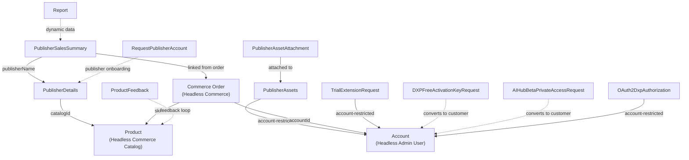

# Marketplace System Audit

## 1. Purpose & Scope

The **Liferay Marketplace** is a modern SaaS application built on Liferay Objects + client extensions that enables software publishers to publish, distribute, and monetize their applications. It serves as both a public storefront where customers discover and purchase apps, and a publisher dashboard for managing products, trials, licenses, and sales analytics.

The Marketplace sits in the middle of Liferay's product ecosystem and integrates with:

- **Koroneiki** — customer account and entitlement management
- **Provisioning** — license key generation and activation for cloud services
- **Console** — DXP instance management and app deployment
- **Salesforce** — opportunity tracking for sales operations
- **Liferay Cloud** — trial instance provisioning for Solutions7 and SSA_SAAS products

Codebase: `<liferay-portal>/workspaces/liferay-marketplace-workspace/`
Database: `e5a2_lpartition_11706165`

---

## 2. Data Model

All object definitions use the `MARKETPLACE` folder and `company` scope. These are the nouns that will become Liferay Objects in the consolidated workspace.

### Publisher Management

**PublisherDetails**
- Purpose: Core publisher profile and metadata
- Key fields: `publisherName`, `emailAddress`, `location`, `description`, `publisherProfileImage`, `showContactForm`, `showOnHomePage`, `catalogId`
- Relationships: Linked to Commerce Catalog (via `catalogId`)
- Business rule: Can be account-restricted

**PublisherAssets**
- Purpose: Versioned digital assets/code managed by publishers
- Key fields: `version`
- Relationships: Account-restricted (via `r_accountEntryToPublisherAssets_accountEntryId`)
- Enriched by related `PublisherAssetAttachment` records

**PublisherAssetAttachment**
- Purpose: Source code artifacts (zip, war, jar) uploaded by publishers
- Key fields: `sourceCode` (Attachment, max 200MB), `name`, `processed` (Boolean)
- Constraints: Accepts `.zip`, `.war`, `.jar` only
- Use: Attached to marketplace apps; `processed` flag indicates submission stage

**PublisherSalesSummary**
- Purpose: Aggregated quarterly revenue tracking per publisher
- Key fields: `publisherName` (required), `quarter` (required, format "YYYY QN"), `paidBy`, `paidDate`
- Driven by: Cron job `_processPublisherSalesSummary` that scans completed orders and creates summaries
- Relationships: Links to commerce orders via `r_publisherToCommerceOrder_c_publisherSalesSummaryId`

### Customer Requests & Feedback

**RequestPublisherAccount** — Onboarding requests from prospective publishers. Fields: `firstName`, `lastName`, `emailAddress`, `requestDescription`, `phoneNumber`, `intlCode`, `extension`. Manual review via control panel.

**ProductFeedback** — Structured feedback on products/marketplace. Fields: `fullName`, `emailAddress`, `companyName`, `jobTitle`, `notify`, ratings (`ratingEaseOfUse`, `ratingSatisfaction`, `ratingUsefulness` 0–10), suggestions (`suggestionFeatures`, `suggestionImprovements`, `suggestionSatisfaction`). Triggered by cron `_processRequestProductFeedback` for orders 7 days old.

**ContactSales** — Sales inquiry capture. Fields: `accountName`, `name`, `email`, `additionalAppsRequested`, `comments`.

**TrialExtensionRequest** — Customer requests to extend Solutions7 or SSA_SAAS trials. Fields: `duration` (Integer days, required), `projectId` (required), `reason`. Account-restricted.

### Registration / Activation Requests

**DXPFreeActivationKeyRequest** — Free activation key requests for DXP. Fields: `businessEmailAddress`, `fullName`, `country`, `domain`, `purpose` (all required); optional `companyName`, `jobTitle`, `phoneNumber`, `notifyMe`.

**AIHubBetaPrivateAccessRequest** — Private beta access for AI Hub. Fields: `businessEmailAddress`, `fullName`, `aiHubAccountName`, `country`, `purpose`, `administratorEmailAddress` (all required); optional `jobTitle`, `phoneNumber`, `companyName`, `extension`, `intlCode`.

### Configuration & Reporting

**Report** — Dynamic JSON-based reporting data. Fields: `name`, `value` (Clob). Example: `PROJECTS-USING-MARKETPLACE` populated by cron.

**OAuth2DxpAuthorization** — DXP connection tokens for customer cloud instances. Fields: `connectionSource`. Account-restricted. Enables Console to authenticate on customer DXP instances.

**LicenseTypesDescription** — Metadata describing license types (Free, Trial, Paid).

**GetAppInfo** — App metadata cache for UI consumption.

### Diagram



---

## 3. Business Logic

### Workflow Definitions

**product-approver-workflow** (in `workflow-definitions/`) — approval flow for new product submissions from publishers. Likely Pending → Under Review → Approved/Rejected. Triggered by `ObjectActionEmailDispatchRestController` on product creation.

### Object Actions (REST hooks)

Defined in `client-extension.yaml`:

- **liferay-marketplace-etc-spring-boot-object-action-email-dispatch** — `POST /object/action/email/dispatch`. Trigger: product submission (`onAfterAdd`). Sends notification via `MARKETPLACE-PRODUCT-SUBMIT-TEMPLATE`. Template vars: `[%CATALOG_NAME%]`, `[%CREATE_DATE%]`, `[%DASHBOARD_URL%]`.
- **liferay-marketplace-etc-spring-boot-object-action-product-purchase** — `POST /object/action/product/purchase`. Handles purchase completion workflows (license activation, provisioning).

### Scheduled Jobs (cron)

The `liferay-marketplace-etc-cron` Spring Boot app runs:

1. **`_processInProgressTrials`** — SSA_SAAS and SOLUTIONS7 trial orders in "In Progress" status. If `trial-end-date` custom field is past, calls `POST /trial/expire/{orderId}`. One day before expiry, calls `POST /trial/notify-end/{orderId}`.

1. **`_processPublisherSalesSummary`** — Scans all paid orders (`paymentStatus == 0`) and creates/links `PublisherSalesSummary` records keyed by publisher catalog + quarter. Links orders via `r_publisherToCommerceOrder_c_publisherSalesSummaryId`.

1. **`_processOnHoldTrials`** — SOLUTIONS7 orders in "On Hold" status. Checks seat availability via `GET /trial/availability` and provisions when seats free up via `POST /trial/provisioning`.

1. **`_processPendingOrders`** — Pending orders excluding AI_HUB, DXP, SOLUTIONS7. Auto-completes free orders (Pending → Processing → Completed). Flags paid orders for manual review.

1. **`_processProjectsUsingMarketplaceApps`** — Aggregates orders since 2025-01-01 from non-Liferay users. Queries Koroneiki for associated projects via `GET /koroneiki/contact/by-email-address/{email}`. Stores output in `Report` with id `PROJECTS-USING-MARKETPLACE`.

1. **`_processLiferayStaffUserGroups`** — Assigns "Liferay Staff" role and "SSA-ACCOUNT" account to employees (queries user group "Employees").

1. **`_processRequestProductFeedback`** — CMP_BETA orders created 7–14 days prior (rolling 6-hour windows). Calls `POST /marketplace/request-product-feedback/{orderId}`.

### Commerce Order Custom Fields

Stored in `CommerceOrder` custom fields:

- `cloud-provisioning` — JSON array of deployment configurations
- `trial-end-date` — ISO offset datetime for trial expiry
- `trial-notify-end-date` — ISO offset datetime for end-of-trial email sent
- `koroneiki-project` — JSON array of Koroneiki project references linked to order creator

---

## 4. UI Surface

### Custom Element (React/TypeScript)
- Type: Web component (`liferay-marketplace-custom-element`)
- Framework: React + Vite
- ~349 TSX files, including `DashboardPage`, `DashboardNavigation`, `DashboardTable`, `Card` variants (`AccountAndAppCard`, `GateCard`, `CheckboxCard`, `DetailedCard`), `DropzoneUpload`, `NewAppFlowList`, `NewAppPageFooterButtons`, and various search/filter/account components
- Config (`client-extension.yaml`): Marketo form IDs (3738 default, 6253 for Liferay products), EULA URLs, contact support URL, Cloud Console URL, Analytics Cloud URL
- Account default: SSA-ACCOUNT for global Marketplace

### Site Initializer

- **Fragment groups**: `marketplace-base-fragments` (hero, search, categories, app displays, forms), `public-sites-navigation` (footer, menu, account menu), `migrated-fragments-from-lrdc` (layout primitives)
- **Display page templates**: `app-detail`, `solutions-details`
- **Page templates**: `solutions-detail`, `solutions-page-template`, `solutions-template`
- **Master pages**: `marketplace-master`, `marketplace-master-private`, `marketplace-blank`
- **DDM templates**: App details (body, sidebar, image gallery, icon, categories, sort, price model, resource requirements, share link, display date, developer name, help/support), search results, language selector, Marketo form embed
- **Commerce catalogs**: Configured for publishing/organizing products

---

## 5. APIs / External Surface

All endpoints require OAuth2 via `liferay-marketplace-etc-spring-boot-oahs` (Headless Server) or `liferay-marketplace-etc-spring-boot-oaua` (User Agent).

### Trial Management — `/trial`
- `GET /trial/availability` — Check available trial seats
- `GET /trial/availability?orderTypeExternalReferenceCode=SOLUTIONS7` — Query by product
- `POST /trial/provisioning/{orderId}` — Provision new trial instance
- `POST /trial/expire/{orderId}` — Mark trial as expired (cron-triggered)
- `POST /trial/notify-end/{orderId}` — Send trial expiry notification (cron-triggered)
- `DELETE /trial/{orderId}` — Decommission trial and delete portal instance

### Marketplace Operations — `/marketplace`
- `GET /marketplace/orders/export` — Export orders to CSV
- `POST /marketplace/request-product-feedback/{orderId}` — Send feedback survey
- `POST /marketplace/publisher/{publisherAccountId}/assets` — Publisher uploads source code
- `POST /marketplace/provisioning/{orderId}` — Provision paid subscriptions

### Console Management — `/console`
- `GET /console/projects-usage` — Project usage metrics for a user
- `GET /console/subscriptions/{orderId}` — Active subscriptions/deployments for order
- `POST /console/provisioning/{orderId}` — Deploy cloud service to project
- `POST /console/uninstall-app/{orderId}` — Uninstall app from project

### DXP Integration — `/dxp`
- `GET /dxp/project-usage?projectId={id}` — Resource usage (CPU, memory)
- `POST /dxp/provisioning/{orderId}` — DXP-specific provisioning workflow

### Koroneiki Integration — `/koroneiki`
- `GET /koroneiki/contact/by-email-address/{email}` — Resolve user to Koroneiki contact + teams
- `GET /koroneiki/entitlements` — Fetch entitlements for account
- `POST /koroneiki/product-purchase` — Register product purchase with entitlement system

### Provisioning Integration — `/provisioning`
- `POST /provisioning/{orderId}` — Create license key for paid app
- `GET /provisioning/status/{orderId}` — Check provisioning status

### Analytics/Reporting — `/analytics`
- `POST /analytics/provision` — Provision Analytics Cloud workspace for customer

### Health — `/ready`
- `GET /ready` — Health check

### Object Actions (Liferay-invoked)
- `POST /object/action/email/dispatch` — Product submission → email notifications
- `POST /object/action/product/purchase` — Order item purchase → provisioning workflow

---

## 6. Integrations

### Koroneiki (Customer Account System)
- Master customer account, contact, and entitlements database
- `KoroneikiService` client (API key auth); reads accounts, contacts, entitlements, product purchases
- Called from: order processing, trial provisioning, project aggregation
- Data: Contact email → teams mapping, entitlements, product purchase history

### Provisioning (License & Activation)
- License key generation and management
- `ProvisioningService` client (OAuth2 via `external-provisioning`)
- `POST /app-license-keys`, `GET /license-keys`
- Called on paid order completion

### Provisioning Hub (Cloud Provisioning Orchestration)
- `ProvisioningHubService` client, `POST /instances` for trial setup
- Manages portal instance creation, DNS (virtual-host), resource allocation
- Called from trial cron and order completion

### Console (DXP Instance Management)
- OAuth2-authenticated endpoints for project usage, app deployment, subscription management
- Bidirectional: reads usage, writes deployment configs

### Salesforce (Sales CRM)
- `SalesforceService` client via Google Cloud Function proxy (OAuth2 + OIDC)
- `POST /marketplace-api/v1/opportunities` — order metadata → Opportunity records
- Async (best-effort); failures are logged but not retried

### Liferay Cloud (Instance Management)
- Portal Instance headless API (`Liferay.Headless.Portal.Instances.everything`)
- `GET /portal-instances`, `DELETE /portal-instances/{id}`
- Trial instance lifecycle (provisioning, expiry cleanup)

### Analytics/Faro (Usage Analytics)
- `AnalyticsService` client (Basic auth)
- `POST /o/faro/main/project/unprovisioned`
- Triggered on free DXP order completion

### Marketo (Marketing Automation)
- Form IDs embedded in custom element: 3738 (general), 6253 (Liferay products)
- Forms on contact-sales, feedback, trial-request pages
- No direct API — form submission goes straight to Marketo from client

### Notifications (Liferay Notification REST API)
- `NotificationQueueEntryResource`, `NotificationTemplateResource`
- `POST /notification-queue-entries` with template reference
- Templates referenced: `MARKETPLACE-PRODUCT-SUBMIT-TEMPLATE`

### Data Flow Summary

```
Customer Order
  ├─→ Commerce Catalog / Product
  ├─→ [Paid Order]
  │    ├─→ Koroneiki (entitlement sync)
  │    ├─→ Provisioning (license key)
  │    └─→ Salesforce (opportunity)
  └─→ [Trial Order]
       ├─→ Provisioning Hub (instance creation)
       ├─→ Liferay Cloud (instance management)
       └─→ Cron (expiry, notifications, project usage aggregation)
```

---

## 7. Row Counts

Live counts from `e5a2_lpartition_11706165`:

| Object | Rows |
|---|---:|
| GetAppInformation | 496 |
| OAuth2DXPAuthorization | 225 |
| PublisherDetails | 134 |
| Sample | 30 (likely test data) |
| PublisherAssets | 16 |
| TrialExtensionRequest | 13 |
| RequestPublisherAccount | 12 |
| PublisherSalesSummary | 8 |
| PublisherAssetAttachment | 6 |
| Report | 2 |
| LicenseTypesDescription | 0 |
| UserAdditionalInfo | 0 |

**Discrepancies between the site-initializer JSON and live DB:**

- **Not deployed (no Object Definition in DB):** `ContactSales`, `ProductFeedback`, `DXPFreeActivationKeyRequest`, `AIHubBetaPrivateAccessRequest`. Either these JSONs haven't been applied to this environment, or they've been removed from the initializer and the audit's object list is stale.
- **In DB but not in my §2 list:** `GetAppInformation`, `UserAdditionalInfo`, `Sample`. `Sample` is almost certainly scratch/test data (30 rows). `GetAppInformation` (496 rows) and `UserAdditionalInfo` (0) should be confirmed as real product surface.

**Takeaways:**
- Marketplace is a **low-data-volume** system — the highest count is 496 rows. The complexity is in the business logic (cron jobs, integrations, workflow), not data migration.
- `Sample` table and zero-row tables suggest some Objects are vestigial; review before porting.

---

## 8. Open Questions / Gotchas

1. **Account restriction model** — PublisherAssets, TrialExtensionRequest, OAuth2DxpAuthorization are account-restricted. Migration must preserve these relationships or implement equivalent role-based access.

1. **Custom field lifecycle** — Orders store JSON in custom fields (trial dates, provisioning configs). Schema changes break running instances.

1. **Cron interdependencies** — Multiple cron jobs read/write the same orders. Any downtime cascades; no alerting visible beyond logs.

1. **Koroneiki project resolution** — Trial provisioning depends on email → Koroneiki contact → teams. Failures silently skip orders.

1. **Portal instance cleanup** — Trial expiry deletes portal instances with no soft-delete or audit trail. Recovery needs cloud backups.

1. **Salesforce sync reliability** — Async via GCF, best-effort. Failures logged, not retried. Missed opportunities unreconcilable.

1. **License key issuance** — Orders sit in Processing if Provisioning is slow/down. No timeout or escalation.

1. **Multi-tenancy** — All objects company-scoped. Consolidation must clarify company strategy.

1. **Notification template names** — Hard-coded strings (`MARKETPLACE-PRODUCT-SUBMIT-TEMPLATE`). Typos silently fail.

1. **Published/draft state** — No visible workflow on PublisherAssets before provisioning; only `processed` flag on PublisherAssetAttachment.

1. **Payment status mapping** — Constants hard-coded in Java (0 = completed, 3 = failed, etc.), implicit sync with Liferay Commerce.

1. **Analytics provisioning** — Free DXP orders auto-provision Analytics workspaces; cost/quota implications not visible.

1. **Timezone handling** — Trial dates use `ZonedDateTime.now()` (system tz) but stored as ISO. Cron runs in system tz, queries use UTC. Potential off-by-one-day bugs.

---

## Migration Notes (for the new workspace)

- **Objects port directly** — these are already Liferay Objects; mostly re-apply definitions with any field cleanups.
- **Cron jobs are the migration's critical path** — 7 scheduled tasks orchestrate trial lifecycle, sales reporting, and aggregation. Must re-implement in new workspace or replace with Liferay scheduled tasks.
- **REST API contract is stable** — preserve paths and response shapes to avoid breaking the React custom element.
- **React custom element can move as-is** — already modern (Vite + React + TS).
- **Commerce dependency** — Marketplace relies heavily on `CommerceOrder`, `CommerceCatalog`, `CPDefinition`. If consolidation touches the commerce layer, all cron jobs need regression testing.