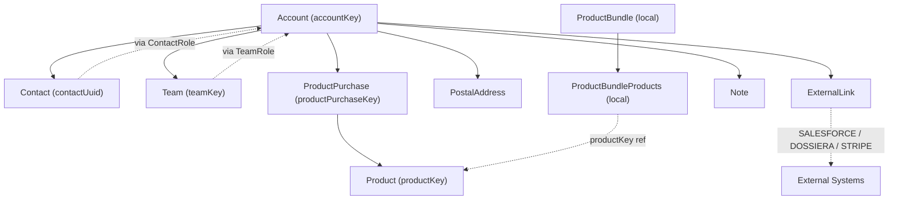

# Provisioning System Audit

> **Note on vestigial integrations:** this audit documents the code as-is. **Zendesk and LCS are already retired at the business layer** — the `ZendeskTicketWebService` / `LCSSubscriptionEntryWebService` code paths still exist in `osb-provisioning` but no live systems receive those calls. Dossiera is also on the drop list (see `../plan/system-spec.md` D6, D8, D12). Treat references to these below as historical context, not active integrations.

## 1. Purpose & Scope

The **Provisioning** system is Liferay's customer account provisioning and license management platform. It transforms Salesforce sales opportunities into production customer environments, acting as the bridge between Sales (Salesforce), customer data (Koroneiki), Support (Zendesk), and license compliance (LCS).

It creates and manages customer accounts, assigns development teams, tracks product subscriptions, enforces SLA and developer limits, and orchestrates multi-system synchronization via RabbitMQ messaging. Users: provisioning admins, support teams, and automated processes triggered by Salesforce opportunity stage changes.

Key architectural fact: **Provisioning is a thin orchestrator, not a data owner.** Its only locally-owned tables are `Provisioning_ProductBundle` and `Provisioning_ProductBundleProducts`. Everything else (Account, Contact, Team, Product, ProductPurchase, ExternalLink, Note, PostalAddress, ContactRole, TeamRole, AuditEntry) lives in **Koroneiki** and is accessed via the Phloem REST client.

Codebase: `<liferay-portal-ee>/modules/dxp/apps/osb/osb-provisioning/`
Database: `prov` (locally-owned bundle tables only)

---

## 2. Data Model

### Local Entities (owned by Provisioning)

**ProductBundle**
- Purpose: Logical grouping of related products for bundled licensing
- Fields: `productBundleId` (PK), `name` (unique), `companyId`, `userId`, `createDate`, `modifiedDate`
- UUID-enabled for deduplication
- Exceptions: `ProductBundleName`, `RequiredProduct`, `ProductPurchaseQuantity`, `ContactRequired`

**ProductBundleProducts**
- Purpose: Junction linking products to bundles
- Composite PK: (`productBundleId`, `productKey`)
- Indexed by both

*These are plumbing. Core business data lives in Koroneiki.*

### Remote Entities (Koroneiki REST API — accessed via proxy)

**Account** — Customer organization. Key fields: `accountKey` (PK), `name`, `code` (auto-generated, unique, ≤12 chars), `region` (GLOBAL, HUNGARY, US, BRAZIL, JAPAN, CHINA, INDIA, SPAIN, AUSTRALIA), `contactEmailAddress`. Relationships: contacts[], teams[], postalAddresses[], productPurchases[], externalLinks[].

**Contact** — Person. Fields: `contactUuid` (PK), `firstName`, `lastName`, `emailAddress`, `languageId`. Roles: `ACCOUNT_CUSTOMER` (customer org employee), `ACCOUNT_WORKER` (Liferay internal/partner staff).

**ContactRole** — Role definition. Fields: `key`, `name` (e.g., "Member", "Manager", "Admin"), `type` (`ACCOUNT_CUSTOMER` | `ACCOUNT_WORKER`).

**Team** — Group of contacts (e.g., "Support Team", "First-Line Support", "Partner Team"). Fields: `teamKey` (PK), `name`. Relationships: contacts[], roles[].

**Product** — Liferay offering (e.g., "Liferay DXP", "Liferay Analytics Cloud"). Fields: `productKey` (PK), `name`. Linked to Dossiera via ExternalLink.

**ProductPurchase** — Subscription instance. Fields: `productPurchaseKey` (PK), `startDate`, `endDate`, product ref, account ref, `quantity`, `properties` (JSON: environment, sizing, productType).

**Note** — Rich text notes (account-scoped). Types: `GENERAL` | `PINNED`.

**ExternalLink** — Reference to external system entity. Fields: `entityId`, `domain` (SALESFORCE | DOSSIERA | STRIPE | ...), `entityName` (e.g., SALESFORCE_ACCOUNT, DOSSIERA_PRODUCT).

**PostalAddress** — Billing/shipping address.

### Diagram

---

## 3. Business Logic

### 3.1 Dossiera/Salesforce → Account Creation (`DossieraCreateMessageSubscriber`)

**Trigger:** RabbitMQ message on `dossiera.provisioning.create` (exchange `is_dossiera_exchange`, queue `is_osb_provisioning_queue`).

**Gating rule:** Salesforce opportunity stage must be:
- `Closed Won` AND type ≠ `Renewal`, OR
- `Closed Lost` AND type = `Renewal`

Others are silently ignored (debug log).

**Product family filter:** Only `E`, `P`, `S` (Enterprise, Provisioning, Support).

**Flow:**

1. Parse message: account name, postal address (ship > bill), contacts (first/last/email → `ACCOUNT_CUSTOMER`), products with quantity/sizing/environment, Salesforce/Dossiera ExternalLinks, sales region ("sold by").

1. **Support region mapping:** Hard-coded map "Liferay X" → Region (11 sales regions → 9 `Account.Region` enum values). E.g., Liferay US/Canada → UNITED_STATES, Liferay Spain → SPAIN (or HUNGARY for Greece/Cyprus/Italy). Default: GLOBAL.

1. Duplicate check: search Koroneiki for existing account with same name → warning flag.

1. New vs update: check Dossiera ExternalLink. If exists → update (add contacts, roles, purchases). Else → create new.

1. Create account:
   - Generate code (extract from name + project, max 12 chars, uppercase, auto-increment on collision).
   - Create Contacts (`ACCOUNT_CUSTOMER`).
   - Create PostalAddress (ship > bill, fallback "N/A").
   - Create ProductPurchases.
   - Create ExternalLinks to Salesforce (account, project, opportunity) and Dossiera.
   - Call `AccountWebService.addAccount()`.

1. Validation warnings: max developer count vs actual contacts, opportunity type vs account existence mismatch.

1. **Zendesk ticket** (if product family ≠ "P"):
   - Title: `New Subscription for {AccountName}` (prepend `[Warning] ` if warnings).
   - Custom fields: opportunity owner, address country, support region, product = "Provisioning Request".
   - Body: account details, opportunity type, provisioning portal link, Salesforce opp link, warnings, pinned notes.

1. **Email:** `SubscriptionSender` for Provisioning onboarding; Analytics Cloud welcome if product name contains "Liferay Analytics Cloud Subscription - Business" or "Enterprise".

### 3.2 Product Purchase Sync to LCS (`ProductPurchaseMessageSubscriber`)

**Trigger:** RabbitMQ on `koroneiki.productpurchase.{create|update|delete}`.

**Logic:** Call `LCSSubscriptionEntryWebService.syncToLCS(accountKey)`.

**LCS pipeline** (`LCSSubscriptionEntryWebServiceImpl`): classifies products by name substring → `LicenseType` enum; merges purchases/consumptions into `LCSSubscriptionEntry`; POSTs to LCS gateway at `/osb-lcs-gateway-web/api/jsonws/lcsgateway/send-lcs-subscription-entries`.

**Sentinels:**
- Perpetual end date: `4102444800000L` (2100-01-01)
- Unlimited servers: `10000`
- `productVersion`: hard-coded `7000` if name contains "Digital Enterprise Backup", else `6200`

### 3.3 Product Deletion Cascade (`ProductMessageSubscriber`)

**Trigger:** RabbitMQ on `koroneiki.product.delete`.

**Logic:** Find all `ProductBundleProducts` for deleted product → delete from bundle. If bundle becomes empty → delete bundle.

### 3.4 Error Handling (`BaseMessageSubscriber`)

Any exception during message parsing creates a Zendesk ticket with subject "Auto-Provisioning Error", body containing routing key, payload, stack trace. Group/requester/organization from `ProvisioningDistributedMessagingConfigurationValues`.

### Business Rules (from `AccountReaderImpl`)

- SLA rank: Platinum=4 > Gold=3 > Silver=2 > Limited=1
- Max developer count: tiered by production-instance count × SLA
- Support region derived from Salesforce "Sold By" via hard-coded 11-entry map

### Scheduled/Async Tasks

**None.** Entirely event-driven via RabbitMQ. No `SchedulerEntry` components. Emails use `SubscriptionSender.flushNotificationsAsync()`. Zendesk retries with configurable `retryWaitTime` (default 90s) for HTTP errors.

---

## 4. APIs / External Surface

**No REST/GraphQL/JSON-WS API is exposed.** No `rest-config.yaml`, no `*Resource.java`. Only outbound calls. External callers must go through Koroneiki or the portlet UI.

### Internal OSGi Services

#### Koroneiki Web Services (proxy layer)
- **AccountWebService**: `addAccount`, `updateAccount`, `getAccount`, `fetchAccount`, `search`, `assignContactRoles`, `unassignContactRoles`, `assignTeamRoles`, `unassignTeamRoles`, `unassignCustomerContact`, `unassignWorkerContact`, `getContactAccountsCount`
- **ProductPurchaseWebService**: `addProductPurchase`, `getProductPurchase`, `updateProductPurchase`, `getProductPurchases`
- **ContactWebService**: CRUD + `getContactByEmailAddress`
- **TeamWebService, ContactRoleWebService, TeamRoleWebService, ExternalLinkWebService, NoteWebService, PostalAddressWebService, ProductWebService, ProductConsumptionWebService, AuditEntryWebService**: standard CRUD

#### Zendesk Web Services
- **ZendeskTicketWebService**: create/get/update tickets
- **ZendeskOrganizationWebService**: `getZendeskOrganization(externalId)`
- **ZendeskUserWebService**: user CRUD

#### LCS
- **LCSSubscriptionEntryWebService**: `syncToLCS(accountKey)`

#### Local Service
- **ProductBundleLocalService**: CRUD, finders by name/bundleId/productKey

### Portlets (UI)

Five portlets with MVC pattern:

- **AccountsPortlet** — view/edit/add accounts, assign contacts/teams, manage related accounts
- **ProductsPortlet** — manage product catalog (admin)
- **ProductBundlesPortlet** — manage bundled product groups
- **AdminPortlet** — system admin, debug tools (e.g., `DebugRabbitMQMVCActionCommand` at `/admin/debug_rabbitmq`)
- **UsersPortlet** — manage contacts/users

### Message Destinations (RabbitMQ)

| Topic | Direction | Purpose |
|-------|-----------|---------|
| `dossiera.provisioning.create` | Dossiera → Provisioning | Account creation from Salesforce opportunity |
| `koroneiki.productpurchase.create` | Koroneiki → Provisioning | Sync purchase to LCS |
| `koroneiki.productpurchase.update` | Koroneiki → Provisioning | Sync purchase to LCS |
| `koroneiki.productpurchase.delete` | Koroneiki → Provisioning | Sync purchase to LCS |
| `koroneiki.product.delete` | Koroneiki → Provisioning | Cascade delete from bundles |

---

## 5. Integrations

### Inbound

| System | Protocol | Purpose |
|--------|----------|---------|
| Salesforce | RabbitMQ (via Dossiera relay) | Opportunity stage/type/metadata |
| Koroneiki | JSON-WS (REST via phloem) | Fetch/create/update core entities |
| Zendesk | HTTP REST (custom connector) | Ticket lifecycle |
| LCS | JSON-WS | License subscription state |
| Dossiera | Via Koroneiki ExternalLinks | Product/account refs |
| Email | SubscriptionSender (portal kernel) | Onboarding |
| RabbitMQ | osb-distributed-messaging | Async workflow |

### Outbound

| System | Purpose |
|--------|---------|
| Koroneiki | Create/update accounts, contacts, teams, purchases |
| Zendesk | Tickets for new subscriptions and error conditions |
| LCS | Sync product purchase state |
| Email | Provisioning + Analytics Cloud welcome emails |
| Customer portal (`osb-customer`) | 4 JSON-WS endpoints + attachment API (owns `AccountEntry` side-car) |

### Koroneiki Boundary (Critical)

Koroneiki is Provisioning's **primary data source and sink**. All CRUD for accounts, contacts, teams, products, purchases flows through `osb-provisioning-koroneiki` web services, which proxy JSON-WS calls to Koroneiki's REST API. Koroneiki is configured via `KoroneikiConfiguration` (host, port, scheme, `apiToken`). **Tightest integration in the system.**

### Zendesk Boundary

Zendesk receives ticket creation for new subscriptions (product family ≠ "P") and auto-error tickets on message failures. `ZendeskConfiguration`: `apiToken`, `domainName`, `emailAddress`, `errorEmailAddress`. Synchronous HTTP with retry backoff. **Loose coupling** — Provisioning does not depend on Zendesk response.

### LCS Boundary

Product purchase changes → `syncToLCS`. Synchronous; failure does not roll back. **Low coupling, informational sync.**

---

## 6. Row Counts

Live counts from `prov`. **Important discovery:** `service.xml` in the audited source only declares `ProductBundle` and `ProductBundleProducts`, but the actual `prov` database contains significant license-key and subscription tables not reflected in the audited codebase — likely owned by other modules deployed into the same DB (LCS? older Provisioning?). Listing them here so the migration team doesn't miss them:

| Table | Rows | Origin |
|---|---:|---|
| Provisioning_LicenseKey | 230,466 | Not in osb-provisioning service.xml |
| OSB_LicenseKey | 201,897 | Legacy `OSB_*` table |
| OSB_OfferingEntry | 76,504 | Legacy |
| Provisioning_SubscriptionEntry | 2,061 | Not in osb-provisioning service.xml |
| Marketplace_Module | 1,817 | Legacy Marketplace (separate from new Marketplace workspace) |
| Provisioning_CommonLicenseKey | 476 | Not in osb-provisioning service.xml |
| Marketplace_App | 344 | Legacy Marketplace |
| OSB_ProductEntry | 112 | Legacy |
| Provisioning_LicenseEntry | 48 | Not in osb-provisioning service.xml |
| Provisioning_ProductVersion | 36 | Not in osb-provisioning service.xml |
| Provisioning_ProductBundleProducts | 23 | Audited ✓ |
| Provisioning_ProductBundle | 5 | Audited ✓ |
| OSB_LicenseEntry | 0 | Legacy (empty) |
| OSB_LicenseKeySet | 0 | Legacy (empty) |

**This is a significant gap in the §2 data model.** The `Provisioning_LicenseKey`, `Provisioning_SubscriptionEntry`, `Provisioning_LicenseEntry`, `Provisioning_ProductVersion`, `Provisioning_CommonLicenseKey` tables represent the **actual license key data** that the Marketplace and Support systems reference. Locate the owning code (likely a sibling `osb-provisioning-license*` module or LCS) before migration planning.

Similarly, the `OSB_*` tables and `Marketplace_App`/`Marketplace_Module` are **legacy Liferay Marketplace (the old app marketplace, unrelated to the new `liferay-marketplace-workspace`)**. These may or may not need to be carried forward — check with the team before discarding.

---

## 7. Open Questions / Gotchas

1. **No REST API exposure** — unusual for a DXP service. All external access via Koroneiki or portlet UI. Intentional to keep admin-only?

1. **Error ticket loop risk** — if Zendesk is unavailable, error ticket creation fails, which then tries to create an error ticket for *that* failure. Unclear if `BaseMessageSubscriber` catches exceptions from `zendeskTicketWebService.createZendeskTicket()`.

1. **Hard-coded product-name matching** — Analytics Cloud detection uses string substring match ("Liferay Analytics Cloud Subscription - Business"/"Enterprise"). Fragile to product rename.

1. **Hard-coded numeric Zendesk custom-field IDs** — Zendesk config carries raw IDs. No validation that fields exist.

1. **Support region hard-coded mapping** — 11-entry table mapping sales regions. No admin UI.

1. **LCS sentinels hard-coded** — `4102444800000L`, `10000`, `7000`/`6200`. Opaque magic numbers.

1. **Product family substring check** — `product.familyKey()` values "E"/"P"/"S" hard-coded.

1. **`BaseWebService` fails on any 3xx** — not just 4xx/5xx; redirects may break.

1. **`DebugRabbitMQMVCActionCommand` production-visible** at `/admin/debug_rabbitmq` — consider access control.

1. **No tests on subscribers** — `DossieraCreateMessageSubscriber`, `ProductMessageSubscriber`, `ProductPurchaseMessageSubscriber` lack unit tests for the parsing + orchestration logic.

1. **No transactional boundaries** — message subscribers have no `@Transactional`. Orphaned records possible if contact creation succeeds but team assignment fails.

1. **Email template localization fallback** — if a locale variant is missing, falls back to unsuffixed English template. No translation workflow noted.

1. **ProductBundle arguably unused** — not referenced by `DossieraCreateMessageSubscriber` or core flows. Admin-managed only. Legacy?

1. **Account hierarchy hinted, not implemented** — `AncestorAccounts` in `AccountReader` suggests parent-child, but Dossiera message doesn't capture parent ref.

1. **`ProductPurchase.properties` is schemaless JSON** — "environment", "sizing", "productType" with no enum validation.

1. **No OpenAPI/contract tests vs Koroneiki** — schema changes in Koroneiki only surface at runtime.

1. **Stripe integration hinted in ExternalLink domain, not implemented** — future or dead?

1. **AuditEntry web service exists but no local persistence** — audit records presumably in Koroneiki; historical tracking unclear.

---

## Migration Notes (for the new workspace)

- **Koroneiki entities are the real migration target** — Account, Contact, Team, ProductPurchase, ExternalLink, Note, PostalAddress, ContactRole, TeamRole become Liferay Objects. Provisioning's local bundle tables either roll up into those Objects or become a small subset.
- **Dossiera message flow → Liferay Object Actions + scheduled tasks** — the `DossieraCreateMessageSubscriber` logic (parse, validate, create, ticket, email) maps to a REST endpoint or object action; the gating/validation rules become Object Validations.
- **Zendesk ticketing → keep as outbound integration** — most likely the new workspace calls the Support system (formerly this repo's `liferay-customer-workspace`) rather than Zendesk directly. See `integrations.md`.
- **LCS sync → keep or replace** — if LCS is retired during consolidation, this pipeline dies with it. Confirm LCS status.
- **Salesforce sync → preserve via Dossiera or rebuild** — if Dossiera is also being retired, need a new Salesforce event pipeline.
- **Region mapping → Liferay Object picklist** — move the hard-coded sales-rep → region map into a reference Object.
- **SLA tiers → Liferay Object field with validation** — move `AccountReaderImpl` business rules into Object Actions/validations.