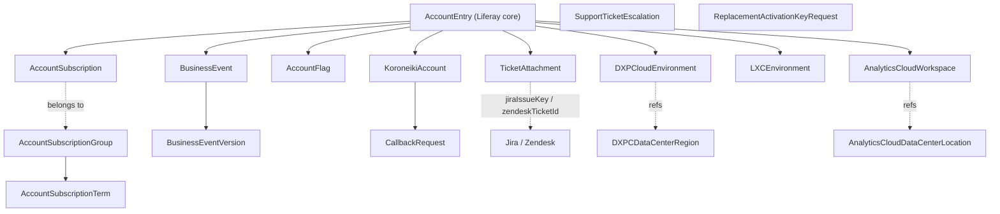

# Support System Audit

## 1. Purpose & Scope

The **Support** system (deployed as the `liferay-customer-workspace`) is a modern Liferay SaaS portal that serves as a multi-tenant customer engagement platform. It functions as a unified hub for:

- **Support ticket escalations** (integration with Jira Service Management / JSM)
- **Callback request management** (customer phone callback requests)
- **Business event tracking** (customer product implementation milestones)
- **Large file uploads** (ticket attachments with GCS backend)
- **Cloud environment management** (DXP Cloud, Experience Cloud, Analytics Cloud environments)
- **Account subscriptions & licensing** (subscription terms, account relationships)
- **Security vulnerability disclosures** (partner/customer notifications)

Users: End customers via public portal; internal Liferay support teams via admin interface.

Architecture: Client-extensions + Liferay Objects + Liferay headless APIs + Spring Boot microservice + Google Cloud Storage + Jira.

Codebase: `<liferay-portal>/workspaces/liferay-customer-workspace/`
Database: `e5a2_lpartition_1860468`

---

## 2. Data Model

24 Liferay Objects defined in JSON under `client-extensions/liferay-customer-site-initializer/site-initializer/object-definitions/`.

### Core Support Objects

**TicketAttachment** (`C_TICKET_ATTACHMENT`)
- Purpose: Large file uploads (> default Liferay limits) for support tickets
- Key fields: `fileName`, `fileSize`, `gcsBucketName`, `gcsObjectName`, `jiraIssueKey`, `zendeskTicketId`, `state` (draft/approved), `md5Checksum`, `draftCommentBody`, `storageProvider`
- Storage: Google Cloud Storage (buckets); Liferay Object record is metadata only
- Relationships: `r_accountEntryToTicketAttachment_accountEntryId`
- Workflow: `DRAFT` → `APPROVED` (or deleted)
- Account-scoped

**SupportTicketEscalation** (`C_SUPPORT_TICKET_ESCALATION`) — Customer-initiated escalation form. Fields: `ticketIds`, `description`, `customerEmailAddress`, `phoneNumber`. Company-wide scope.

**CallbackRequest** (`C_CALLBACK_REQUEST`) — Customer request for support callback. Fields: `name`, `emailAddress`, `phoneNumber`, `countryCode`, `description`, `relatedTicketIDs`. Company-wide.

### Business Events

**BusinessEvent** (`C_BUSINESS_EVENT`) — Tracks customer implementation milestones (go-live, version upgrades). 30+ fields including `eventStatus`, `description`, `currentLiferayVersion`, `associatedTickets`, `actualGoLiveDateTime`, `expectedGoLiveDateTime`, plus DXP/Cloud/Commerce/Analytics tracking. Actions: `onAfterAdd`, `onAfterUpdate` trigger Spring Boot object action. One-to-many to `BusinessEventVersion`. Account-scoped.

**BusinessEventVersion** (`C_BUSINESS_EVENT_VERSION`) — Audit trail of business event changes. Fields: `change` (picklist), `comment`. Many-to-one to BusinessEvent. Account-scoped.

### Account & Subscription Objects

**AccountSubscription** (`C_ACCNT_SUB`) — License/subscription terms. Fields: `accountKey`, `productKey`, `subscriptionGroupERC`, `startDate`, `endDate`, `instanceSize`, `quantity`, `hasDisasterDataCenterRegion`, + ~20 product entitlement fields. Account-scoped.

**AccountSubscriptionGroup** (`C_ACCNT_SUB_GROUP`) — Logical grouping of subscriptions. Fields: `accountKey`, `name`, `groupCode`.

**AccountSubscriptionTerm** (`C_ACCNT_SUB_TERM`) — Terms within a subscription group. Fields: `termCode`, `quantity`, `startDate`, `endDate`.

**AccountFlag** (`C_ACCNT_FLAG`) — Boolean flags on customer accounts (billing, compliance, entitlement). Fields: `flagCode`, `flagValue`. Account-scoped.

### Cloud Environment Objects

**DXPCloudEnvironment** (`C_DXP_CLOUD_ENVIRONMENT`) — Customer DXP Cloud deployments. Fields: `projectKey`, `region`, `environment` (dev/staging/prod), `dxpVersion`, +15 more. Account-scoped.

**LXCEnvironment** (`C_LXC_ENVIRONMENT`) — Liferay Experience Cloud environment tracking. Account-scoped.

**AnalyticsCloudWorkspace** (`C_ANALYTICS_CLOUD_WORKSPACE`) — Analytics Cloud workspace provisioning. Fields: `workspaceKey`, `workspaceStatus`, `implementationDate`. Account-scoped.

**AdminDXPCloud**, **AdminLiferayExperienceCloud** (`C_ADMIN_*`) — Admin-level environment configuration. Account-scoped.

### Koroneiki Integration

**KoroneikiAccount** (`C_KORONEIKI_ACCOUNT`) — Synced data from Koroneiki. Fields: `accountKey`, `code`, `dxpVersion`, `dataRegion`, `acWorkspaceGroupId`, `allowSelfProvisioning`, `liferayContactEmailAddress`, +20 sync fields. One-to-many to CallbackRequest. Account-scoped.

### Request / Workflow Objects

**ReplacementActivationKeyRequest** (`C_REPLACEMENT_ACTIVATION_KEY_REQUEST`) — Customer request for replacement product activation keys. Fields: `companyName`, `contactEmailAddress`, `activeLiferaySubscription`, `clustered` (picklist), `explainReplacementActivationKey`, `acknowledgement`, +10. Company-wide.

**TeamMembersInvitation** (`C_TEAM_MEMBERS_INVITATION`) — Team member invitations. Company-wide.

### Notification Objects

**NotificationTarget** (`C_NOTIFICATION_TARGET`) — Recipients. One-to-many to NotificationSubscription.

**NotificationSubscription** (`C_NOTIFICATION_SUBSCRIPTION`) — Subscription to notification types. Many-to-one from NotificationTarget.

### Reference / Infrastructure

- **CloudNativeEnvironment** (`C_CLOUD_NATIVE_ENVIRONMENT`) — K8s/containerization tracking
- **DXPCDataCenterRegion** (`C_DXPC_DATA_CENTER_REGION`) — DXP Cloud region reference
- **AnalyticsCloudDataCenterLocation** (`C_ANALYTICS_CLOUD_DATA_CENTER_LOCATION`) — Analytics Cloud DC reference
- **BannedEmailDomain** (`C_BANNED_EMAIL_DOMAIN`) — Excluded email domains
- **IncidentReportContactAnalyticsCloud** (`C_INCIDENT_REPORT_CONTACT_ANALYTICS_CLOUD`) — Analytics Cloud incident contacts

### Diagram

---

## 3. Business Logic

### Object Actions (triggers)

- **BusinessEvent** `onAfterAdd` / `onAfterUpdate`
  - Executor: `function#liferay-customer-etc-spring-boot-object-action-business-event`
  - Service: `ObjectActionBusinessEventRestController`
  - Actions: notifications, Jira updates, external system sync

### Scheduled Tasks (Spring Boot)

1. **`TicketAttachmentsRestController.scheduledCleanUp()`** — Daily at 00:00 and 12:00 UTC (`0 0 0,12 * * *`). Cleans up attachments for closed Jira tickets 7–8 days after closure. Projects: `_jiraSupportFLSProject`, `_jiraSupportHCProject`. Statuses from `JiraIssueConstants.STATUSES_CLOSED`.

1. **`scheduledDeleteTicketAttachment()`** — Hourly (`0 0 * * * *`). Deletes trashed (`WorkflowConstants.STATUS_IN_TRASH`) attachments from GCS.

1. **`scheduledUpdateTicketAttachmentDraftCommentBody()`** — Every hour (`0 0 */1 * * ?`). Retries posting draft comments to Jira for attachments with unsent comments. Condition: `draftCommentBody ne null and state eq 0 and status/any(s:s eq 0)`.

1. **`JiraService.scheduledAffectedVersionsCacheEviction()`** — Admin-triggered via `DELETE /jira/cache`. Clears affected-versions cache.

1. **`JiraService.scheduledIssuesCacheEviction()`** — Admin-triggered. Clears issues cache.

### Validations & Constraints

**TicketAttachment**
- Required: `accountKey`, `fileName`, `fileSize`, `gcsBucketName`, `storageProvider`
- MD5 dedup: duplicate (same `fileName` + `ticketId` + `md5Checksum`) rejected unless in `DRAFT`
- State machine: `DRAFT` → `APPROVED` (no revert)
- Draft comment retry: if Jira comment post fails, body stored in `draftCommentBody` for hourly retry

**BusinessEvent**
- Account-restricted (visible only to owning account)
- Picklists: `currentLiferayVersion`, `eventStatus` ("Pending" | "In Progress" | "Completed")

**KoroneikiAccount**
- `accountKey` required (FK to Jira org)
- Sync-only from external Koroneiki

---

## 4. UI Surface

React frontend in `liferay-customer-custom-element`.

### Main Pages (in `/layouts`)

- **01_home** — Dashboard / overview
- **02_projects** — List view of cloud projects/environments
- **03_project** — Single project detail
- **04_onboarding** — Onboarding wizard
- **05_security-vulnerabilities** — Jira-sourced security advisories (read-only)
- **06_release-notes** — Release notes
- **08_callback-request** — Callback request form
- **09_support-ticket-escalation** — Escalation form
- **10_large-file-uploader** — Multi-part upload for ticket attachments
- **11_cookie-policy** — Cookie policy notice

### Features (React components)

- `/features/attachments` — Ticket attachment upload/download UI
- `/features/onboarding` — Onboarding flow steps
- `/features/project` — Single project management
- `/features/projects` — Project listing and filtering
- `/features/security-vulnerabilities` — Vulnerability list and detail

### Shared Components

Action table, Badge, Button, DatePicker, Filter, FormLayout, Input, MultiSelect, Radio, SearchBar, Select, StatusTag, Table, TimePicker, navigation menu icons (DXP, Analytics, Experience Cloud, LXC).

### Context & Hooks

- Apollo GraphQL client (`useApollo`)
- Liferay services (`/services/liferay`)
- RaySource integration (`/services/raysource`)

---

## 5. APIs / External Surface

### Spring Boot REST Endpoints

**TicketAttachments** — `/ticket-attachments`
- `GET /ticket-attachments/by-id/{id}/download` — Signed URL from GCS
- `GET /ticket-attachments/by-external-reference-code/{erc}/download`
- `POST /ticket-attachments/initiate-upload` — Start multipart upload session
- `POST /ticket-attachments/{ticketAttachmentId}/complete-upload` — Finalize + post Jira comment
- `DELETE /ticket-attachments/{ticketAttachmentId}` — Mark trash, delete from GCS

**Tickets** — `/tickets/{ticketId}/ticket-attachments` — Proxy for listing attachments under a Jira ticket

**Jira** — `/jira`
- `GET /jira/issue/{issueKey}` — Issue details (security-project only)
- `DELETE /jira/cache` — Clear caches (admin-only)

**Accounts** — `/accounts` — Account CRUD, Koroneiki account sync

**Object Actions** — `ObjectActionBusinessEventRestController` handles BusinessEvent create/update

**Health** — `ReadyRestController` — readiness probe

### Headless API Consumption
- Headless Admin User (`/o/headless-admin-user/v1.0/user-accounts/{userId}`)
- Headless Object (implied for Object CRUD)

### External APIs Called
- **Jira (JSM)** — REST v3 for issue queries, comments, field lookups
- **Google Cloud Storage** — signed URLs, resumable uploads, object deletion
- **Google Cloud Functions** — via `GoogleCloudFunctionService`

---

## 6. Integrations

### Inbound

**Koroneiki (Provisioning data source)**
- Account metadata, DXP versions, regions, provisioning flags
- Direction: Koroneiki → Support (read-only; via `KoroneikiAccount`, synced externally)
- Related objects: `KoroneikiAccount`, `CallbackRequest`

**Jira Service Management (JSM)**
- Ticket escalations: `SupportTicketEscalation` form → Jira projects
- Ticket attachments: Large files uploaded here, attached as Jira comments (Jira Document Format JSON)
- Security vulnerabilities: Jira Security project issues → `/security-vulnerabilities` UI
- JQL queries: affected versions, closed tickets (age-based cleanup), issue searches by key
- Projects: `_jiraSupportFLSProject` (FLS), `_jiraSupportHCProject` (HC — hosted cloud?)

**Zendesk (legacy)**
- Legacy ticket references in `zendeskTicketId` field on TicketAttachment
- Status: likely legacy; code supports both Zendesk and Jira IDs
- Direction: inbound ticket references

### Outbound

**Google Cloud Storage**
- Multipart uploads for attachments, deletion on closed tickets, signed URL generation
- Buckets: per-attachment `gcsBucketName`

**Email (Liferay Notification Queue)**
- 8 templates in `/notification-templates` for DXP Cloud setup confirmations, business event updates, escalation acknowledgments
- Hardcoded recipients include `solutions@liferay.com`, `cloud-provisioning@liferay.com`
- Services: `NotificationQueueEntryService`, `NotificationTemplateService`

**RaySource (custom service)**
- Frontend integration at `/services/raysource`
- Purpose unclear from code inspection; likely custom data/analytics

**Jira Webhooks (inferred)**
- No explicit handler found; cleanup timing suggests webhook-triggered status checks

---

## 7. Row Counts

Live counts from `e5a2_lpartition_1860468`:

| Object | Rows |
|---|---:|
| BannedEmailDomain | 4,757 |
| AccountSubscription | 4,572 |
| AccountSubscriptionGroup | 3,073 |
| KoroneikiAccount | 2,313 |
| AccountFlag | 557 |
| BusinessEventVersion | 347 |
| TeamMembersInvitation | 321 |
| NotificationSubscription | 309 |
| BusinessEvent | 120 |
| NotificationTarget | 99 |
| TicketAttachment | 75 |
| CallbackRequest | 50 |
| SupportTicketEscalation | 49 |
| AdminLiferayExperienceCloud | 34 |
| CloudNativeEnvironment | 16 |
| DXPCDataCenterRegion | 15 |
| AccountSubscriptionTerm | 13 |
| ReplacementActivationKeyRequest | 11 |
| AdminDXPCloud | 10 |
| IncidentReportContactAnalyticsCloud | 9 |
| LiferayExperienceCloudEnvironment | 9 |
| AnalyticsCloudWorkspace | 8 |
| DXPCloudEnvironment | 5 |
| AnalyticsCloudDataCenterLocation | 5 |
| EmailDelivery | 0 |
| Test2 | 0 (scratch) |

**Discrepancies from the audit list:**

- **In DB but not in my §2 list:** `LiferayExperienceCloudEnvironment`, `EmailDelivery`, `Test2`. `Test2` is scratch. `LiferayExperienceCloudEnvironment` (9 rows) is the LXC equivalent of `DXPCloudEnvironment`; my §2 noted `LXCEnvironment` which is the same entity under a different name. `EmailDelivery` (0 rows) — unclear if planned or abandoned.

**Takeaways:**
- **`BannedEmailDomain` at 4,757** is the largest table — reference data (email domain blocklist) that must port intact.
- **`AccountSubscription` + `AccountSubscriptionGroup` = 7,645 rows** — this is the customer-license-state snapshot that drives the Account entitlement picture. Central for the migration.
- **`KoroneikiAccount` at 2,313** — sync side-car. Once the consolidated workspace owns the real Koroneiki Account Object, this table collapses.
- **`TicketAttachment` at only 75** — the scheduled cleanup is aggressive; most lifetime data lives in GCS and Jira, not here. The Liferay side is a thin metadata index.
- Small CallbackRequest / Escalation counts (~50 each) confirm those flows are low-volume customer-initiated forms.

---

## 8. Open Questions / Gotchas

1. **Zendesk vs Jira** — code references both `zendeskTicketId` and `jiraIssueKey`. Is Zendesk still live or legacy? Migration path unclear.

1. **RaySource** — `/services/raysource` purpose not clear from code; likely custom analytics or data service.

1. **Jira projects FLS vs HC** — unclear if both actively used or legacy split.

1. **Draft comment retry** — hourly retry of failed Jira comments. No dead-letter queue or customer alerting.

1. **GCS service account key** — injected as `_gcsServiceAccountKey`. Ensure rotation.

1. **Koroneiki sync mechanism undefined** — `KoroneikiAccount` is account-restricted but how/when data flows from Koroneiki is not visible. External process?

1. **Account-scoped RBAC** — many objects use `accountEntryRestrictedObjectFieldName`. Ensure multi-tenant isolation.

1. **No workflow XML found** — state machines (e.g., ticket attachment DRAFT → APPROVED) exist in Spring Boot services / object actions, not WCM workflow definitions.

1. **Notification templates triggering** — 8 templates defined but usage/triggering logic partially visible (likely in Object Actions + scheduled tasks).

1. **Security vulnerabilities read-only** — `/security-vulnerabilities` pulls Jira Security project. Confirm Jira side not writable by customers.

1. **Cache eviction is manual** — no TTL visible on Jira caches; only admin endpoints to clear.

1. **Production credentials** — Jira API key, GCS SA, email creds env-injected. Verify no logging leaks.

---

## Migration Notes (for the new workspace)

- **Objects port directly** — already Liferay Objects; re-apply definitions in new workspace.
- **KoroneikiAccount is the glue** — if Koroneiki becomes Liferay Objects in the consolidated workspace, this sync-side-car collapses into the primary Object.
- **TicketAttachment + GCS stays as-is** — the GCS integration is purposeful (files too large for Liferay). Preserve contract.
- **Jira integration likely stays** — JSM is still the ticket system of record. All Jira REST calls, JQL, and webhook points port forward.
- **Zendesk references can be dropped** if it's truly retired — confirm before removing fields.
- **5 scheduled tasks need porting** — cleanup, trash removal, draft comment retry, cache eviction. All in `TicketAttachmentsRestController`/`JiraService`.
- **React custom element ports forward** — already modern.
- **8 notification templates** — port the template IDs + hardcoded recipients (consider making them configurable).