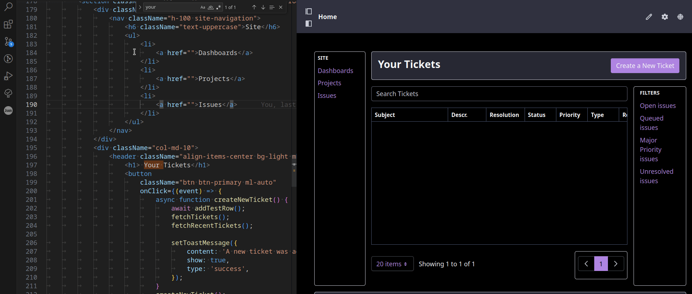

# Dev Mode Configuration

1. Deploy this client extension and start the dev server using `../../gradlew deployDev packageRunDev`

1. Add the extension **Liferay Ticket Custom Element UI (Dev Mode)** to the head of the page where you have the custom element deployed.

Now you should be able to edit source code and the React app will update in Liferay immediately.

Example

